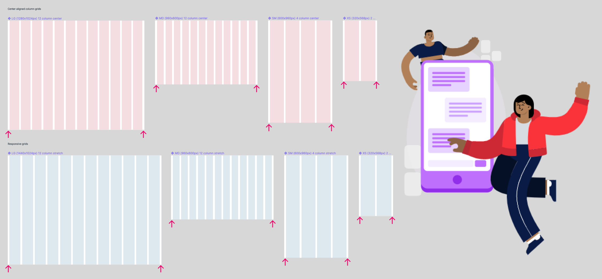

# Migration guide

## Update version 1.x to 2.x

### Changed grid margin from 8px to 16px

- According to newest insights we made some changes to PARKSIDE grid styles. The old margin was set to 8px and we scaled it now to 16px. This allows for more space between content and left and right screen edges.
- Update the PARKSIDE library to the latest version and check out the new [layout grid properties](../../Getting_started/Grid_system/Grid_system.md#layout-grid-properties-in-figma).
