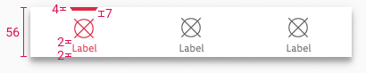

<AlertInfo alertHeadline="Modifiable">
Please ensure to comply with the corporate identity. A detailed list about [what can be modified?](#what-can-be-modified) is defined.
</AlertInfo>

# Bottom bar

Both Android and iOS bottom bars contain navigation options between the three to five top-level destinations in the app.

---

## Recommendations

- It should always be positioned at the bottom of each screen.
- All the destinations inside the bar should be of the same importance.

---

## Anatomy

### Android

1. Indicator

2. Icon in active state

3. Label in active state

### iOS

1. Indicator

2. Icon in active state

3. Label in active state

4. Divider (hairline)

---

## Overall styling

### Android

- The label uses the text-style [small](../../General/Typography/Typography.md#small).
- The line-height is **default**.
- The icon con size is **24x24px**.
- Label text has always **one line**.
- Elevation shadow is always **8dp**.

### iOS

- The title uses the text-style [extra small](../../General/Typography/Typography.md#extra-small).
- The line-height is **120%**.
- The icon con size is **24x24px**.
- Divider at the top has **0.5px** width.
- Label text has always **one line**.

---

## Variants

- Android and iOS bottom bars support both light and dark mode and can have between three to five destinations.

### Android variants

| Destinations | Mode | Attributes | Preview |
|---|---|---|---|
| three | ☀ | background-color: greyscale/light-mode/background/light-1    label-color-default: greyscale/light-mode/general/medium-contrast  label-color-active: brand-primary/base   icon-color-default: greyscale/light-mode/general/medium-contrast   icon-color-active: brand-primary/base   indicator-color: brand-primary/base | 
| three | ☾ | background-color: greyscale/dark-mode/background/android/8dp    label-color-default: greyscale/light-mode/general/medium-contrast label-color-active: greyscale/light-mode/general/high-contrast icon-color-default: greyscale/light-mode/general/medium-contrast   icon-color-active: greyscale/light-mode/general/high-contrast   indicator-color: brand-primary/base | 
| four | ☀ | background-color: greyscale/light-mode/background/light-1    label-color-default: greyscale/light-mode/general/medium-contrast label-color-active: brand-primary/base icon-color-default: greyscale/light-mode/general/medium-contrast   icon-color-active: brand-primary/base   indicator-color: brand-primary/base | 
| four | ☾ | background-color: greyscale/dark-mode/background/android/8dp    label-color-default: greyscale/light-mode/general/medium-contrast label-color-active: greyscale/light-mode/general/high-contrast  icon-color-default: greyscale/light-mode/general/medium-contrast  icon-color-active: greyscale/light-mode/general/high-contrast   indicator-color: brand-primary/base | 
| five | ☀ | background-color: greyscale/light-mode/background/light-1    label-color-default: greyscale/light-mode/general/medium-contrast label-color-active: brand-primary/base  icon-color-default: greyscale/light-mode/general/medium-contrast    icon-color-active: brand-primary/base   indicator-color: brand-primary/base | 
| five | ☾ | background-color: greyscale/dark-mode/background/android/8dp    label-color-default: greyscale/light-mode/general/medium-contrast  label-color-active: greyscale/light-mode/general/high-contrast  icon-color-default: greyscale/light-mode/general/medium-contrast   icon-color-active: greyscale/light-mode/general/high-contrast   indicator-color: brand-primary/base | 

### iOS variants

| Destinations | Mode | Attributes | Preview |
|---|---|---|---|
| three | ☀ | divider: greyscale/light-mode/general/low-contrast    background: iOS-material/light-mode/thick    label-color-default: greyscale/light-mode/general/medium-contrast  label-color-active: brand-primary/base   icon-color-default: greyscale/light-mode/general/medium-contrast   icon-color-active: brand-primary/base   indicator-color: brand-primary/base | 
| three | ☾ | divider: greyscale/dark-mode/general/low-contrast   background: iOS-material/dark-mode/thick    label-color-default: greyscale/light-mode/general/medium-contrast label-color-active: greyscale/light-mode/general/high-contrast icon-color-default: greyscale/light-mode/general/medium-contrast   icon-color-active: greyscale/light-mode/general/high-contrast   indicator-color: brand-primary/base | 
| four | ☀ | divider: greyscale/light-mode/general/low-contrast   background: iOS-material/light-mode/thick    label-color-default: greyscale/light-mode/general/medium-contrast label-color-active: brand-primary/base icon-color-default: greyscale/light-mode/general/medium-contrast   icon-color-active: brand-primary/base   indicator-color: brand-primary/base | 
| four | ☾ | divider: greyscale/dark-mode/general/low-contrast   background: iOS-material/dark-mode/thick    label-color-default: greyscale/light-mode/general/medium-contrast label-color-active: greyscale/light-mode/general/high-contrast  icon-color-default: greyscale/light-mode/general/medium-contrast  icon-color-active: greyscale/light-mode/general/high-contrast   indicator-color: brand-primary/base | 
| five | ☀ | divider: greyscale/light-mode/general/low-contrast   background: iOS-material/light-mode/thick    label-color-default: greyscale/light-mode/general/medium-contrast label-color-active: brand-primary/base  icon-color-default: greyscale/light-mode/general/medium-contrast    icon-color-active: brand-primary/base   indicator-color: brand-primary/base | 
| five | ☾ | divider: greyscale/dark-mode/general/low-contrast   background: iOS-material/dark-mode/thick    label-color-default: greyscale/light-mode/general/medium-contrast  label-color-active: greyscale/light-mode/general/high-contrast  icon-color-default: greyscale/light-mode/general/medium-contrast   icon-color-active: greyscale/light-mode/general/high-contrast   indicator-color: brand-primary/base | 

---

## Spacing & measurements

### Android spacing

| Type | Description | Preview |
|---|---|---|
| horizontal spacing | The width of the screen is divided by the number of destinations in order to calculate the width of each destination section. All objects within the destination section are horizontally centered. | |
| vertical spacing | The bar height adheres to the rule of 8 but due to the number of objects within, the objects are aligned optically and violate the rule of 8. | |

### iOS spacing

| Type | Description | Preview |
|---|---|---|
| horizontal spacing | The width of the screen is divided by the number of destinations in order to calculate the width of each destination section. All objects within the destination section are horizontally centered. | |
| vertical spacing | The bar height adheres to the rule of 8 but due to the number of objects within, the objects are aligned optically and violate the rule of 8. | |
---

## What can be modified?

- Override the text and icons.
- Adjust the width.

## Our workflow in Figma

- Use the light or dark mode bottom bar with desired number of destinations.
