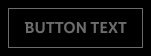

<AlertWarning alertHeadline="Not modifiable"> 
It is mandatory to maintain the appearance and behavior of these components.
</AlertWarning>

# Button

A button should lead the user to a certain action. Unique labels give the user a clear message which action is exactly triggered.

The actions can be separated into two buttons. The design of two different buttons shows the user a visual distinctions which action is needed to fulfill his task. Visually separating the primary and secondary buttons also helps to draw the attention of the user on a certain action.

---

## Overall styling

- The title text-style is [button text](../../General/Typography/Typography.md#button-text).
- The line-height is set to **default**.
- The thickness of an outline is 1px inside.

---

## Recommendations

### Do's

- The secondary button can be used without the primary button.
- Keep the text short and use as few words as possible.
- Always use a specific call to action text.
- Choose a unique button labeling to send a clear message which action is exactly triggered by the button.
- Ensure consistent labelling across the user journey.
- Be sure to allow enough space for translation into other languages.

### Dont's

- Do not use more than two buttons below each other.
- Avoid exclamation marks.

**Hint!** You can use **text** as an alternative to a button to offer the secondary action.

---

## Types

- You can use different types of buttons: **icon**, **icon with label**, **label**, **text**.

### Primary

- Our primary button is also our **Call-to-Action (CTA)** button.
- It only should be used once per page.
- It gives the user a hint to fulfill his task.
- It's used to guide the user into taking certain actions.
- It usually invites users to: sign in, register, purchase, etc.
- It is used to strongly suggest something that "we" want the user to do in first place.

### ☀ Light mode styling for primary

| State | Icon| Icon with label | Label | Color | Text | Color |
|---|---|---|---|---|---|---|
| default |  |  |  | background: brand-primary/base text: basic/white icon: basic/white |  | text-color: brand-primary/base |
| active |  |  |  | background: brand-primary/dark text: basic/white icon: basic/white |  | text-color: brand-primary/dark|
| disabled |  |  |  | background: greyscale/light-mode/general/low-contrast text: greyscale/light-mode/general/medium-contrast   icon: greyscale/light-mode/general/medium-contrast|  | text-color: greyscale/light-mode/general/low-contrast |

### ☾ Dark mode styling for primary

| State | Icon| Icon with label | Label | Color | Text | Color |
|---|---|---|---|---|---|---|
| default |  |  |  | background: brand-primary/base text: basic/white  icon: basic/white |  | text-color: basic/white |
| active |  |  |  | background: brand-primary/dark text: basic/white  icon: basic/white |  | text-color: brand-primary/light|
| disabled |  |  |  | background: greyscale/light-mode/general/low-contrast text: greyscale/light-mode/general/medium-contrast icon: greyscale/light-mode/general/medium-contrast|  | text-color: greyscale/dark-mode/general/low-contrast |

### Secondary

- Use our secondary button if you want to show more than one button.
- It should only be used in conjunction with the primary button.
- It is offered to show the user a supporting task.
- It isn't as important and shouldn’t call as much attention as the Primary/CTA.
- Normally secondary buttons can be used more than once per page.
- It offers users an alternative to the Primary/CTA (e.g. "back" instead of "next"; "add to wishlist" instead of "add to cart"; "edit", "delete", etc.).
- It leads the user away from his primary task or forwards to subpages of the website.

### ☀ Light mode styling for secondary

| State | Icon| Icon with label | Label | Color |
|---|---|---|---|---|
| default |  |  |  | background: basic/white stroke: brand-primary/base text: brand-primary/base icon: brand-primary/base |
| active |  |  |  | background: basic/white stroke: brand-primary/dark text: brand-primary/dark  icon: brand-primary/dark |
| disabled |  |  |  | background: basic/white stroke: greyscale/light-mode/general/low-contrast text: greyscale/light-mode/general/low-contrast icon: greyscale/light-mode/general/low-contrast |

### ☾ Dark mode styling for secondary

| State | Icon| Icon with label | Label | Color |
|---|---|---|---|---|
| default |  |  |  | stroke: basic/white text: basic/white icon: basic/white |
| active |  |  |  | stroke: brand-primary/light text: brand-primary/light icon: brand-primary/light |
| disabled |  |  |  | stroke: greyscale/dark-mode/general/low-contrast text: greyscale/dark-mode/general/low-contrast icon: greyscale/dark-mode/general/low-contrast |

---

## Spacing & measurements

| Type | Attributes | Preview |
|---|---|---|
| Horizontal | Buttons can be variable in width but icon and text are always centered and have 16px minimum spacing left and right. Spacing between icon and button text is always 8px. |  |
| Vertical | text is _vertically centered_ |  |
| Height | 40px |  |
| Distance  | 8px between two buttons |  |
| Icon size | icon-size: 24x24px |  |
