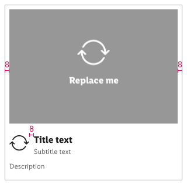

<AlertInfo alertHeadline="Modifiable">
Please ensure to comply with the corporate identity. A detailed list about [what can be modified?](#what-can-be-modified) is defined.
</AlertInfo>

# Card

- The card component is interactive and its content should be easy to scan.
- It has a clear hierarchy of how different elements should be placed.

---

# Overall styling

- The title text-style is [basic bold](../../General/Typography/Typography.md#basic-bold).
- The subtitle and description text-style is [small](../../General/Typography/Typography.md#small).
- The line-height is set to **default**.
- Images have a global ratio of **4:3**.

## Recommendation

- Title and subtitle text length should be one line only.
- Description text length shouldn't be longer than three lines.

Light mode | 
---------|----------
**Dark mode** | 

| Elements | Preview |
|---|---|
|1. Image  2. Icon (optional) 3. Title (Title text + subtitle text)  4. Description (optional) 5. Card background surface||

---

## Elements

### ☀ Light mode styling

| Types | Attributes | Preview |
|---|---|---|
| default | **icon-color:** greyscale/light-mode/general/high-contrast **title-text-color:** greyscale/light-mode/general/high-contrast **sub-title-text-color:** greyscale/light-mode/general/medium-contrast **description-text-color:** greyscale/light-mode/general/medium-contrast **background-color:** greyscale/light-mode/background/light-2 **surface-stroke:** solid greyscale/light-mode/general/low-contrast |  |

### ☾ Dark mode styling

| Types | Attributes | Preview |
|---|---|---|
| default | **icon-color:** greyscale/dark-mode/general/high-contrast **title-text-color:** greyscale/dark-mode/general/high-contrast **sub-title-text-color:** greyscale/dark-mode/general/high-contrast **description-text-color:** greyscale/dark-mode/general/high-contrast **background-color:** greyscale/dark-mode/general/low-contrast **surface-stroke:** solid greyscale/dark-mode/general/high-contrast |  |

---

## Spacing & measurements

| Types | Attributes | Preview |
|---|---|---|
| horizontal spacing | padding: 8px The card component can be variable in width. If the icon is not used the text is left aligned to the image/description text with no padding. |  |
| vertical spacing | padding-top: 8px padding after image: 16px padding between title and description: 8px padding-bottom: 16px |   |

---

## What can be modified?

- Override the text.
- Adjust the width of single symbols according to the width of the device.
- Override the icon or delete it.
