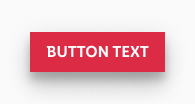
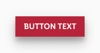
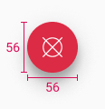
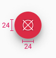
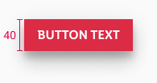
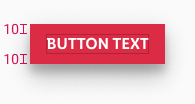
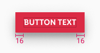
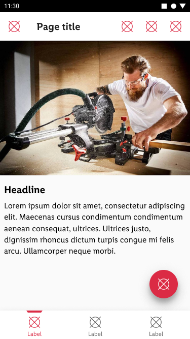
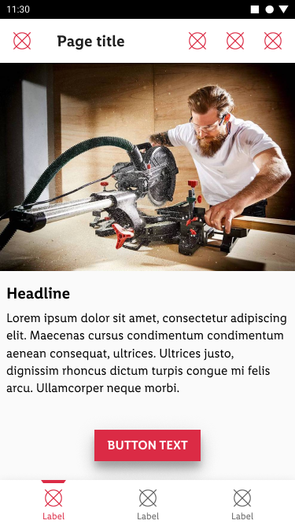

<AlertWarning alertHeadline="Not modifiable"> 
It is mandatory to maintain the appearance and behavior of these components.
</AlertWarning>

# Floating action button

A sticky button that floats over the content of an screen. It always has the highest level of emphasis on the screen.

It supports the primary navigation and offers the user a fast option to navigate.
There are **two types** of floating action buttons and they look the same in **dark** and **light** modes.

---

## Recommendations

### Do's

- Please ensure that the floating action button has a positive function (e.g. open a menu, share, more, etc.).
- Choose an icon that refers to the content behind the interaction with the button.
- Use the floating action button only once per site.
- Use the button efficiently in the layout. Content such as image galleries, shopping basket, etc. does not suit the floating action button.

### Dont's

- Don’t overlay the floating action button with additional elements like badges.
- Don’t use the floating action button for negative functions (e.g. delete).
- Don’t change the shape of the floating action button.

---

## Overall styling

- The *regular* type component always comes in the shape of a circle.
- The *extended* type component always comes in the shape of a rectangle.
- For the *extended* type the [button-text](../../General/Typography/Typography.md#button-text) style. The alignment is always center.
- It uses the shadow android-light-mode 16dp.

| Types | Attributes | Preview |
|---|---|---|
| regular, default | background: brand-primary/base icon-color: basic/white |  |
| regular, active | background: basic/black icon-color: basic/white |  |
| extended, default | background: brand-primary/base text-color: basic/white |  |
| extended, active | background: brand-primary/base text-color: basic/white |  |

---

## Spacing & measurements

| Types | Attributes | Preview |
|---|---|---|
| regular shape | 56x56px |  |
| regular icon size | 24x24px |  |
| extended height | 40px |  |
| extended vertical-spacing | 10px |  |
| extended horizontal-spacing | 16px |  |

---

## Position & usage

- The optimal position for the regular floating action button is the lower right corner.
- The optimal position for the extended floating action button is in the lower middle area.
- This area is easily reachable for the user.

| Types | Preview |
|---|---|
| Smartphone regular floating action button |  |
| Smartphone extended floating action button |  |

---

## What can be modified?

- Change the icon.
- The width of the extended floating action button.
- Check the recommendations of this component.