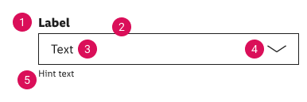

<AlertWarning alertHeadline="Not modifiable">
It is mandatory to maintain the appearance and behavior of these components.
</AlertWarning>

# Forms

Forms are used to accept the user's input. They can be displayed in many different ways: input- or select-fields, check boxes or radio buttons. They serve to get information and guide the user through each task with minimal effort.

---

## Possible use cases

- Login and registration (check-in, check-out)
- Transaction (orders, payment)
- Contact (support, callbacks, requests)
- Data collection (lotteries, newsletters, surveys)
- Contribution (blogs, comments, posts)

---

## Recommendations

- Always try to keep the form and the text as short as possible!
- A short form helps the user to get a fast overview and to easily recognize what is required.
- If you use an input field as a single row or with a fixed height, demonstrate an overflow text (clipping) by an ellipse.
- If there is more than one option but only one can be selected, use a radio button instead of a checkbox.

---

## Selection controls

### Overall styling

- Text-style is [basic](../../General/Typography/Typography.md#basic).
- The line-height is set to **default**.
- Borders have a **2px** thickness.
- Active states are always shown with a border in **brand-primary-base**.
- Icon size is **20x20px**.

### Checkbox

- Choose a checkbox if the user must make one or more decisions about a particular element.
- Each checkbox in a group represents a separate and independent choice.
- Checked checkboxes use an embedded element as icon which isn't included in the icon sprite.

### ☀ Light mode styling for checkbox

| States | Attributes | Preview |
|---|---|---|
| unselected default | text-color: greyscale/light-mode/general/high-contrast border: greyscale/light-mode/general/high-contrast |  |
|unselected active| text-color: brand-primary/base  border: brand-primary/base  |  |
|unselected disabled | text-color: greyscale/light-mode/general/low-contrast border: greyscale/light-mode/general/low-contrast |  |
| unselected error | text-color: orange/darker border: orange/base |  |
| selected default | text-color: brand-primary/base color: brand-primary/base icon-color: basic/white |  |
| selected active | text-color: brand-primary/base color: brand-primary/base icon-color: basic/white |  |
| selected disabled | text-color: greyscale/light-mode/general/low-contrast color: greyscale/light-mode/general/low-contrast icon-color: basic/white |  |
| selected error | text-color: orange/darker color: orange/base icon-color: basic/white | |

### ☾ Dark mode styling for checkbox

| States | Attributes | Preview |
|---|---|---|
| unselected default | text-color: greyscale/dark-mode/general/high-contrast border: greyscale/dark-mode/general/high-contrast |  |
|unselected active| text-color: brand-primary/light  border: brand-primary/light  |  |
|unselected disabled | text-color: greyscale/dark-mode/general/low-contrast border: greyscale/dark-mode/general/low-contrast |  |
| unselected error | text-color: orange/light border: orange/base |  |
| selected default | text-color: brand-primary/light color: brand-primary/base icon-color: basic/white |  |
| selected active | text-color: brand-primary/light color: brand-primary/base icon-color: basic/white |  |
| selected disabled | text-color: greyscale/dark-mode/general/low-contrast color: greyscale/dark-mode/general/low-contrast icon-color: basic/white |  |
| selected error | text-color: orange/darker color: orange/base icon-color: basic/white | |

### Radio button

- Choose a radio button if the user needs to select a single option from multiple options, or if you want the user to carefully consider the options and see all available ones.
- Selected radio buttons use our "bullet.svg" as icon.

### ☀ Light mode styling for radio button

| States | Attributes | Preview |
|---|---|---|
| unselected default | text-color: greyscale/light-mode/general/high-contrast border: greyscale/light-mode/general/high-contrast |  |
| unselected active | text-color:  brand-primary/base border:  brand-primary/base|  |
| unselected disabled | text-color: greyscale/light-mode/general/low-contrast border: greyscale/light-mode/general/low-contrast |  |
| unselected error | text-color: orange/darker border: orange/base |  |
| selected default | text-color: brand-primary/base border: brand-primary/base icon-color: brand-primary/base |  |
| selected active | text-color: brand-primary/base border: brand-primary/base icon-color: brand-primary/base |  |
| selected disabled | text-color: greyscale/light-mode/general/low-contrast border: greyscale/light-mode/general/low-contrast icon-color: greyscale/light-mode/general/low-contrast|  |
| selected error | text-color: orange/darker border: orange/base icon-color: orange/base | |

### ☾ Dark mode styling for radio button

| States | Attributes | Preview |
|---|---|---|
| unselected default | text-color: greyscale/dark-mode/general/high-contrast border: greyscale/dark-mode/general/high-contrast |  |
| unselected active | text-color:  brand-primary/light border:  brand-primary/light|  |
| unselected disabled | text-color: greyscale/dark-mode/general/low-contrast border: greyscale/dark-mode/general/low-contrast |  |
| unselected error | text-color: orange/light border: orange/base |  |
| selected default | text-color: brand-primary/light border: brand-primary/base icon-color: brand-primary/base |  |
| selected active | text-color: brand-primary/light border: brand-primary/base icon-color: brand-primary/base |  |
| selected disabled | text-color: greyscale/dark-mode/general/low-contrast border: greyscale/dark-mode/general/low-contrast icon-color: greyscale/dark-mode/general/low-contrast|  |
| selected error | text-color: orange/light border: orange/base icon-color: orange/base | |

### iOS selection

- Used for multiple selections in iOS.
- Can be combined with iOS list component.

### ☀ Light mode styling for iOS selection

| States | Attributes | Preview |
|---|---|---|
| unselected | outline-color: greyscale/light-mode/general/extra-low-contrast |  |
| selected | background-color: brand-primary/base   icon-color: basic/white |  |

### ☾ Dark mode styling for iOS selection

| States | Attributes | Preview |
|---|---|---|
| unselected | outline-color: greyscale/dark-mode/general/low-contrast |  |
| selected |background-color: brand-primary/base   icon-color: basic/white |  |

---

## Form fields

### Overall styling

- Text-style for **labels** is [basic-bold](../../General/Typography/Typography.md#basic-bold).
- Text style for **hint** and **error** text is [small](../../General/Typography/Typography.md#small).
- Text style for the text inside input and selection fields is [basic](../../General/Typography/Typography.md#basic).
- The line-height is set to **default**.
- Borders have a **1px** thickness.
- Active, success or error states for input and selection fields always have an **inside aligned 2px border**.
- Icon size is **24x24px**.
- Blinking cursor in active state has brand-primary/base color.

### Input field

- Use input fields in the various states to show the user that data can be entered.
- They typically appear in forms and dialogs.

### Input field anatomy

1. Label
2. Border
3. Input text
4. Icon
5. Hint/error text

### ☀ Light mode styling for input fields

| States | Attributes | Preview |
|---|---|---|
| default | label-color: greyscale/light-mode/general/high-contrast  border-color: greyscale/light-mode/general/high-contrast  border-thickness: 1px icon-color: greyscale/light-mode/general/high-contrast hint-color: greyscale/light-mode/general/high-contrast | |
| active | label-color: greyscale/light-mode/general/high-contrast  border-color: greyscale/light-mode/general/high-contrast  border-thickness: 2px input-color: greyscale/light-mode/general/high-contrast  icon-color: greyscale/light-mode/general/high-contrast hint-color: greyscale/light-mode/general/high-contrast |  |
| disabled | label-color: greyscale/light-mode/general/low-contrast  border-color: greyscale/light-mode/general/low-contrast  border-thickness: 1px input-color: greyscale/light-mode/general/low-contrast icon-color: greyscale/light-mode/general/low-contrast hint-color: greyscale/light-mode/general/low-contrast |  |
| success | label-color: greyscale/light-mode/general/high-contrast  border-color: green/base  border-thickness: 2px input-color: greyscale/light-mode/general/high-contrast icon-color: green/base hint-color: greyscale/light-mode/general/high-contrast |  |
| error | label-color: greyscale/light-mode/general/high-contrast  border-color: orange/base  background-color: orange/lightest  border-thickness: 2px input-color: orange/darker icon-color: orange/darker hint-color: orange/darker |  |

### ☾ Dark mode styling for input fields

| States | Attributes | Preview |
|---|---|---|
| default | label-color: greyscale/dark-mode/general/high-contrast  border-color: greyscale/dark-mode/general/high-contrast  border-thickness: 1px input-color: greyscale/dark-mode/general/high-contrast  icon-color: greyscale/dark-mode/general/high-contrast hint-color: greyscale/dark-mode/general/high-contrast | |
| active | label-color: greyscale/dark-mode/general/high-contrast  border-color: greyscale/dark-mode/general/high-contrast  border-thickness: 2px input-color: greyscale/dark-mode/general/high-contrast icon-color: greyscale/dark-mode/general/high-contrast hint-color: greyscale/dark-mode/general/high-contrast |  |
| disabled | label-color: greyscale/dark-mode/general/low-contrast  border-color: greyscale/dark-mode/general/low-contrast  border-thickness: 1px input-color: greyscale/dark-mode/general/low-contrast icon-color: greyscale/dark-mode/general/low-contrast hint-color: greyscale/dark-mode/general/low-contrast |  |
| success | label-color: greyscale/dark-mode/general/high-contrast  border-color: green/light  border-thickness: 2px input-color: greyscale/dark-mode/general/high-contrast icon-color: green/light hint-color: greyscale/dark-mode/general/high-contrast |  |
| error | label-color: greyscale/dark-mode/general/high-contrast  border-color: orange/base  border-thickness: 2px input-color: orange/light icon-color: orange/light hint-color: orange/light |  |

---

### Select field

- The select field is part of forms and opens a list of options.
- In Android tapping on the select field causes a standard menu with options (radio button choices) to appear.
- In iOS tapping on the select field causes wheels-style picker to appear in the bottom.
- The consistent appearance of a select field compared to other form elements (input field, checkbox, etc.) is important and also refers to the different states.
- Select fields use our "arrow-down.svg" as icon.

### Select field anatomy

1. Label
2. Border
3. Input text
4. Icon
5. Hint/error text

### ☀ Light mode styling for select fields

| States | Attributes | Preview |
|---|---|---|
| default | label-color: greyscale/light-mode/general/high-contrast  border-color: greyscale/light-mode/general/high-contrast  border-thickness: 1px input-color: greyscale/light-mode/general/high-contrast icon-color: greyscale/light-mode/general/high-contrast hint-color: greyscale/light-mode/general/high-contrast |  |
| active | label-color: greyscale/light-mode/general/high-contrast  border-color: greyscale/light-mode/general/high-contrast  border-thickness: 2px input-color: greyscale/light-mode/general/high-contrast icon-color: greyscale/light-mode/general/high-contrast hint-color: greyscale/light-mode/general/high-contrast |  |
| disabled | label-color: greyscale/light-mode/general/low-contrast  border-color: greyscale/light-mode/general/low-contrast  border-thickness: 1px input-color: greyscale/light-mode/general/low-contrast icon-color: greyscale/light-mode/general/low-contrast hint-color: greyscale/light-mode/general/low-contrast |  |
| error | label-color: greyscale/light-mode/general/high-contrast  border-color: orange/base border-thickness: 2px  background-color: orange/lightest input-color: orange/darker icon-color: orange/darker hint-color: orange/darker |  |

### ☾ Dark mode styling for select fields

| States | Attributes | Preview |
|---|---|---|
| default | label-color: greyscale/dark-mode/general/high-contrast  border-color: greyscale/dark-mode/general/high-contrast  border-thickness: 1px input-color: greyscale/dark-mode/general/high-contrast icon-color: greyscale/dark-mode/general/high-contrast hint-color: greyscale/dark-mode/general/high-contrast |  |
| active | label-color: greyscale/dark-mode/general/high-contrast  border-color: greyscale/dark-mode/general/high-contrast  border-thickness: 2px input-color: greyscale/dark-mode/general/high-contrast icon-color: greyscale/dark-mode/general/high-contrast hint-color: greyscale/dark-mode/general/high-contrast |  |
| disabled | label-color: greyscale/dark-mode/general/low-contrast  border-color: greyscale/dark-mode/general/low-contrast  border-thickness: 1px input-color:reyscale/dark-mode/general/low-contrast icon-color: greyscale/dark-mode/general/low-contrast hint-color: greyscale/dark-mode/general/low-contrast |  |
| error | label-color: greyscale/dark-mode/general/high-contrast  border-color: orange/base border-thickness: 2px input-color:orange/light icon-color: orange/light hint-color: orange/light |  |

---

### Labels

- Labels are part of the input- or select field.
- They use [basic-bold](../../General/Typography/Typography.md#basic-bold) as label- and [basic](../../General/Typography/Typography.md#basic) as optional-text.
- Give each form element a unique label.
- The **(optional)** part is fixed and is used for labels where user input isn't mandatory.

| States | Attributes | Preview | Combinations |
|---|---|---|---|
| default | text-color: greyscale/light-mode/general/high-contrast |  |  |

---

## Spacing & measurements

| Type | Attributes | Preview
|---|---|---|
| horizontal  | 8px margin between radio button (or checkbox) 16px padding between input box / input text and input text / icon|               |
| vertical  | 8px padding inside the unput box 2px between label / input box and input box / hint text  16px |    |
| icon size | 24px |   |
| distance | minimum 16px top to another component |       |

---
