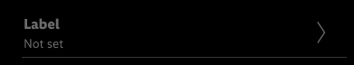
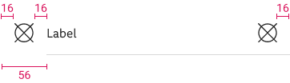

<AlertInfo alertHeadline="Modifiable">
Please ensure to comply with the corporate identity. A detailed list about [what can be modified?](#what-can-be-modified) is defined.
</AlertInfo>

# Lists

Lists are interactive components which are used to show content in a vertical order from top to bottom. When tapped, they bring the user to a separate page which either shows the relevant content in connection with the list title (general list) or offers the user the options to choose from (list picker).

---

## Recommendations

- Always try to keep the text inside the lists as short as possible!
- Lists are set on top of each other, they don't need any spacing between.
- Android styleguide tries to avoid dividers in lists, so use them sparingly.
- A short form helps the user to get a fast overview and to easily recognize what is required.
- All text in lists is single row, so demonstrate an overflow text (clipping) by an ellipse.
- List pickers lead user to a separate page where an option can be chosen.
- iOS list pickers always have an arrow on the right side and Android list pickers don't.

---

## Overall styling

### Android styling

- Text-style for Android labels is [basic](../../General/Typography/Typography.md#basic) and color for **light mode** is greyscale/light-mode/general/high-contrast and for **dark mode** is greyscale/dark-mode/general/high-contrast.
- Text-style for value-text is [small](../../General/Typography/Typography.md#small) and color for **light mode** is greyscale/light-mode/general/high-contrast and for **dark mode** is greyscale/dark-mode/general/high-contrast.
- The line-height is set to **default**.
- Android dividers have 1px thickness and color for **light mode** is greyscale/light-mode/general/extra-low-contrast and for **dark mode** is greyscale/dark-mode/general/extra-low-contrast.
- Icon size is always **24x24px** and color in **light mode** is greyscale/light-mode/general/high-contrast and in **dark mode** is greyscale/dark-mode/general/high-contrast.
- When list is disabled icons and text in **light mode** have greyscale/light-mode/general/low-contrast color and in **dark mode **have greyscale/dark-mode/general/low-contrast color.

### iOS styling

- Text style for iOS labels is [basic bold](../../General/Typography/Typography.md#basic-bold) and color for **light mode** is greyscale/light-mode/general/high-contrast and for **dark mode** is greyscale/dark-mode/general/high-contrast..
- Text style for value-text is [small](../../General/Typography/Typography.md#small) and color for **light mode** is greyscale/light-mode/general/high-contrast and for **dark mode** is greyscale/dark-mode/general/high-contrast.
- The line-height is set to **default**.
- Dividers have 0.5px thickness and color in **light mode** is greyscale/light-mode/general/low-contrast and in **dark mode** the color is greyscale/dark-mode/general/low-contrast.
- Icon size is always **24x24px** and color in **light mode** is greyscale/light-mode/general/high-contrast and in **dark mode** is greyscale/dark-mode/general/high-contrast.
- When list is disabled icons and text in **light mode** have greyscale/light-mode/general/low-contrast color and in **dark mode** have greyscale/dark-mode/general/low-contrast color.

---

## Anatomy

### Android list picker

1. Label
2. Value
3. Divider (optional-preferred without)

### Android general list

1. Label
2. Divider (optional-preferred without)

### iOS list picker

1. Label
2. Value
3. Divider (always present)
4. Right arrow icon (always present)

### iOS general list

1. Label
2. Value
3. Divider (always present)
4. Right arrow icon (always present)

---

## List picker

- It is used to set a value which is selected on a separate page.

### ☀ Light mode styling for Android

| States |  Preview |
|---|---|
| default |  |
| disabled |  |

### ☾ Dark mode styling for Android

| States |  Preview |
|---|---|
| default |  |
| disabled |  |

### ☀ Light mode styling for iOS

| States |  Preview |
|---|---|
| default |  |
| disabled |  |

### ☾ Dark mode styling for iOS

| States |  Preview |
|---|---|
| default |  |
| disabled |  |

---

## General list

- It functions as a menu and takes the user to a destination described by the label.
- It can be used with or without icon on the left for bot Android and iOS.

### Android states

| States |  Preview |
|---|---|
| default |  |
| disabled |  |

### iOS states

| States |  Preview |
|---|---|
| default |  |
| disabled |  |

---

## Spacing & measurements

### List picker specs

| Type | Preview
|---|---|
| iOS picker horizontal with icon |  |
| iOS picker horizontal without icon |  |
| iOS picker vertical with icon |  |
| iOS picker vertical without icon  |  |
| Android picker horizontal with icon |  |
| Android picker horizontal without icon |  |
| Android picker vertical with icon |  |
| Android picker vertical without icon |  |

### General list specs

| Type | Preview
|---|---|
| iOS general horizontal with icon  |  |
| iOS general horizontal without icon  |  |
| iOS general vertical with icon |  |
| iOS general vertical without icon |  |
| Android general horizontal with icon |  |
| Android general horizontal without icon |  |
| Android general vertical with icon |  |
| Android general vertical without icon |  |

---

## Our workflow in Figma

- Choose the desired list type by using the switches shown with the component variants in the right panel.

## What can be modified?

- Override text, dividers, icons according to needs.
- Adjust the width.
