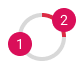
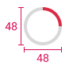
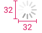
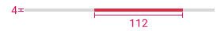

<AlertInfo alertHeadline="Modifiable">
Please ensure to comply with the corporate identity. A detailed list about [what can be modified?](#what-can-be-modified) is defined.
</AlertInfo>

# Progress indicator

In an ongoing process the user will see the feedback in form of a progress indicator component.
For example loading content, submitting forms or saving updates.

- We use native Android and iOS progress indicator components in combination with PARKSIDE brand colors.
- There are two types of progress indicators to support both determinate and indeterminate processes:
  - **Determinate**  The invisible track is filled with color and the indicator moves from 0 to 360 degrees.
  - **Indeterminate**  The indicator grows and shrinks in size while moving along the invisible track.

---

## Linear progress indicator

### Anatomy

1. Track
2. Indicator

### ☀ Light mode styling for Android and iOS

Attributes | Preview |
---------|----------|
 track color: greyscale/light-mode/general/extra-low-contrast  indicator color: brand-primary/base |  |

### ☾ Dark mode styling for Android and iOS

Attributes | Preview |
---------|----------|
 track color: greyscale/dark-mode/general/extra-low-contrast  indicator color: brand-primary/base |  |

---

## Circular progress indicator

### Anatomy

1. Track
2. Indicator

### ☀ Light mode styling for Android

Attributes | Preview |
---------|----------|
 track color: greyscale/light-mode/general/extra-low-contrast  indicator color: brand-primary/base |  |

### ☾ Dark mode styling for Android

Attributes | Preview |
---------|----------|
 track color: greyscale/dark-mode/general/extra-low-contrast   indicator color: brand-primary/base |  |

### ☀ Light mode styling for iOS

Attributes | Preview |
---------|----------|
 angular color: greyscale/light-mode/general/low-contrast   opacity: 64%  greyscale/light-mode/general/extra-low-contrast   opacity: 8%|  |

### ☾ Dark mode styling for iOS

Attributes | Preview |
---------|----------|
 angular color: greyscale/dark-mode/general/low-contrast   opacity: 64%  greyscale/dark-mode/general/extra-low-contrast   opacity: 8% |  |

---

## Spacing & measurements

Type | Attributes | Preview |
---------|---------|----------|
Android determinate / indeterminate circular indicator | size: 48x48px |  |
 iOS indeterminate circular indicator | size: 32x32px |  |
 Android / iOS determinate linear indicator | height: 4px   length: depends on progress|  |
  Android indeterminate linear indicators |  height: 4px   indicator length: 112px |  |

---

## What can be modified?

- Scale the circle indicator.
- Adjust the width for the linear indicator.
