<AlertInfo alertHeadline="Modifiable">
Please ensure to comply with the corporate identity. A detailed list about [what can be modified?](#what-can-be-modified) is defined.
</AlertInfo>

# Search Bar

It is a component which consists of a standard iOS and Android top bar with the addition of search functionality. Users can find the content they are looking for by inputting a query inside the search field.

We use native Android and iOS search field components in combination with PARKSIDE colors, icons and typography.

---

## Recommendations

- If the text for the search query is too long the text shouldn't be cut with ellipsis at the right search field border, instead it should continue normally with left part of the text disappearing behind the left field border.
- For both platforms the search bar view can be triggered via a search icon in the top bar, via search tab in the bottom bar or via a search button placed somewhere else in the page layout.

---

## Anatomy

### Android

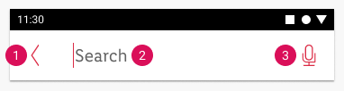

1. Arrow left icon for closing the search view
2. Search placeholder text
3. Microphone icon (optional) or X icon (obligatory) for clearing out the text input when search field is active.

### iOS

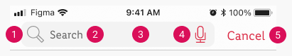

1. Magnifier icon (non-interactive)
2. Search placeholder text
3. Search field shape
4. Microphone icon (optional) or X icon (obligatory) for clearing out the text input when search field is active.
5. Button for closing the search view

---

## Overall styling

### Android

- The text-style is [large](../../General/Typography/Typography.md#large).
- The line-height is set to **default**.

### iOS

- The text-style is [basic](../../General/Typography/Typography.md#basic).
- The line-height is set to **default**.

### ☀ Light mode styling for Android

| States | Attributes | Preview |
|---|---|---|
| default | left-icon: brand-primary/base right-icon: brand-primary/base text-color: greyscale/light-mode/general/medium-contrast background-color: greyscale/light-mode/background/light-1 | 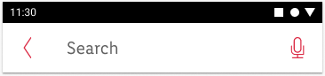 |
| activated | left-icon: brand-primary/base right-icon: brand-primary/base text-color: greyscale/light-mode/general/medium-contrast ackground-color: greyscale/light-mode/background/light-1 | 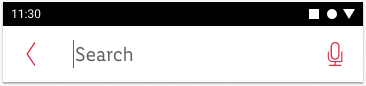 |
| active | left-icon: brand-primary/base right-icon: greyscale/light-mode/general/high-contrast text-color: greyscale/light-mode/general/high-contrast background-color: greyscale/light-mode/background/light-1 | 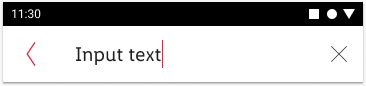 |

### ☾ Dark mode styling for Android

| States | Attributes | Preview |
|---|---|---|
| default | left-icon: greyscale/dark-mode/general/high-contrast right-icon: greyscale/dark-mode/general/high-contrast text-color: greyscale/dark-mode/general/medium-contrast background-color: greyscale/dark-mode/background/Android/1dp  | 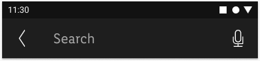 |
| activated | left-icon: greyscale/dark-mode/general/high-contrast right-icon: greyscale/dark-mode/general/high-contrast text-color: greyscale/dark-mode/general/medium-contrast background-color: greyscale/dark-mode/background/Android/1dp  | 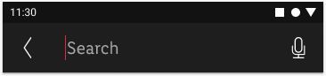 |
| active | left-icon: greyscale/dark-mode/general/high-contrast right-icon: greyscale/dark-mode/general/high-contrast text-color: greyscale/dark-mode/general/high-contrast  background-color: greyscale/dark-mode/background/Android/1dp   | 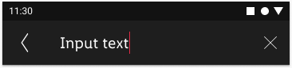 |

### ☀ Light mode styling for iOS

| States | Attributes | Preview |
|---|---|---|
| default | left-icon: greyscale/light-mode/general/low-contrast right-icon: brand-primary/base  text-color: greyscale/light-mode/general/medium-contrast search-field-color: greyscale/light-mode/background/light-3 | 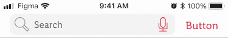 |
| activated | left-icon: greyscale/light-mode/general/low-contrast right-icon: brand-primary/base text-color: greyscale/light-mode/general/medium-contrast search-field-color: greyscale/light-mode/background/light-3 | 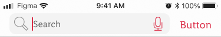 |
| active | left-icon: greyscale/light-mode/general/low-contrast right-icon: left-icon: greyscale/light-mode/general/high-contrast text-color: greyscale/light-mode/general/medium-contrast search-field-color: greyscale/light-mode/background/light-3 | 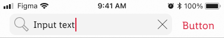 |

### ☾ Dark mode styling for iOS

| States | Attributes | Preview |
|---|---|---|
| default | left-icon: greyscale/dark-mode/general/low-contrast right-icon: greyscale/dark-mode/general/high-contrast text-color: greyscale/dark-mode/general/medium-contrast search-field-color: greyscale/dark-mode/background/iOS/level-4 |  |
| activated | left-icon: greyscale/dark-mode/general/low-contrast right-icon: brand-primary/base text-color: greyscale/dark-mode/general/medium-contrast search-field-color: greyscale/dark-mode/background/iOS/level-4 | 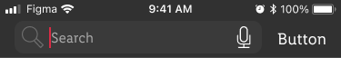 |
| active | left-icon: greyscale/dark-mode/general/low-contrast right-icon: greyscale/dark-mode/general/high-contrast text-color: greyscale/dark-mode/general/high-contrast search-field-color: greyscale/dark-mode/background/iOS/level-4| 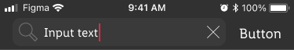 |

---

## Spacing & measurements

### Android

| Types | Attributes | Preview |
|---|---|---|
| horizontal spacing | left and right margins: 16px text-box to left icon: 32px  text-box to right icon: 16px| 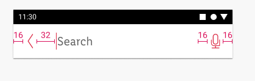 |
| vertical spacing | bar-height: 56px All elements are vertically centered. | 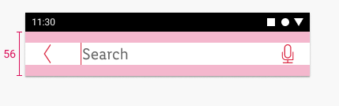 |
| icon size | 24x24px and 16x16px| 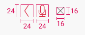 |

### iOS

| Types | Attributes | Preview |
|---|---|---|
| horizontal spacing | left and right margins: 16px left search-field border to icon: 8px right search-field border to icon: 8px text-box to left and right icon: 8px | 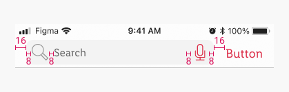 |
| vertical spacing | standard iOS search field height: 36px All elements are vertically centered. | 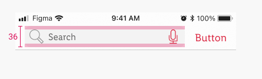 |
| icon size | 24x24px and 16x16px| 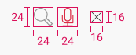 |

---

## What can be modified?

- Adjust the width of the search bar.
- Use another icon instead of microphone icon according to needs - e.g. QR code icon or camera icon.
- On iOS icon buttons can be used left or right from the search field.
