<AlertInfo alertHeadline="Modifiable">
Please ensure to comply with the corporate identity. A detailed list about [what can be modified?](#what-can-be-modified) is defined.
</AlertInfo>

# Sheet

A sheet is a component which is used to present a modal view where information and actions related to the parent view are available to the user.

---

## Android modal bottom sheet

- It should always be used with an overlay screen, unless used in a map-like context where user needs to retain the ability to navigate the screen view.
- User exits the view by swiping the sheet down or by tapping outside the sheet.
- User enlarges the view by swiping the sheet upwards and the screen then transforms into a full screen modal.
- Grabber and title are optional.
- Keep the modal title short, long modal title names will be end up with an ellipsis.
- The modal title always has one-line.

### Anatomy of Android modal bottom sheet

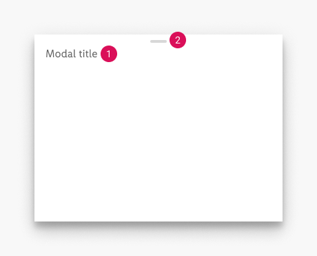

1. Modal title (optional)
2. Grabber (optional)

### ☀ Light mode styling for Android

| Attributes |  Modal bottom sheet | Full screen modal |
|---|---|---|
| text-color: greyscale/light-mode/general/medium-contrast   grabber-color: greyscale/light-mode/general/extra-low-contrast   background-color: basic/white   shadow: Android-light-mode/16dp | 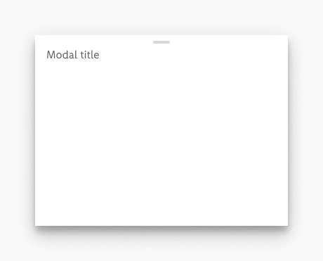 | 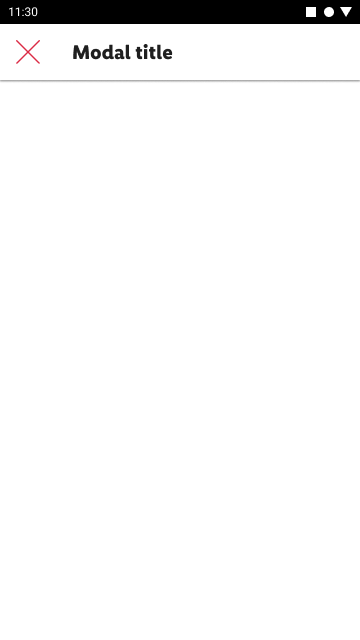   \* For attributes take a look at [top bar](../Top%20bar/Top%20bar.md). |

### ☾ Dark mode styling for Android

| Attributes | Modal bottom sheet | Full screen modal |
|---|---|---|
| text-color: greyscale/dark-mode/general/medium-contrast   grabber-color: greyscale/dark-mode/general/low-contrast   background-color: greyscale/dark-mode/background/Android/16dp   shadow: Android-dark-mode/16dp | 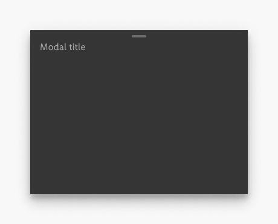 | 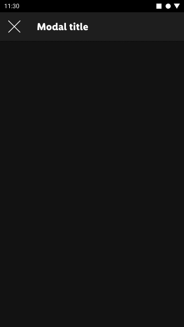   \* For attributes take a look at [top bar](../Top%20bar/Top%20bar.md). |

## iOS modal bottom sheet

- It should always be used with an overlay screen, unless used in a map-like context where user needs to retain the ability to navigate the screen view.
- User exits the view by tapping the "X" icon, swiping the sheet down or by tapping outside the sheet.
- User enlarges the view by swiping the sheet upwards and the screen then transforms into a full screen modal.
- Grabber and icons are optional.
- Text buttons can be used instead of the icons.
- Keep the modal title short, long modal title names will be end up with an ellipsis.
- The modal title always has one-line.

### Anatomy of iOS modal bottom sheet

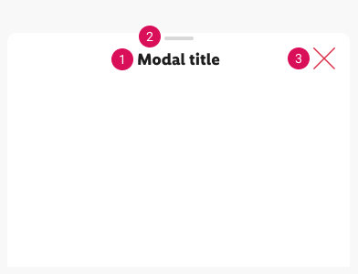

1. Modal title
2. Grabber (optional)
3. Icon (optional)

### ☀ Light mode styling for iOS

| Attributes | Modal bottom sheet | Full screen modal |
|---|---|---|
| corner-radius: 10px   text-color: greyscale/light-mode/general/high-contrast   grabber-color: greyscale/light-mode/general/extra-low-contrast   icon-color: brand-primary/base   background-color: basic/white | 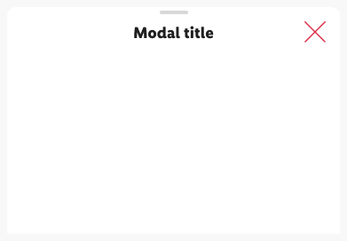 | 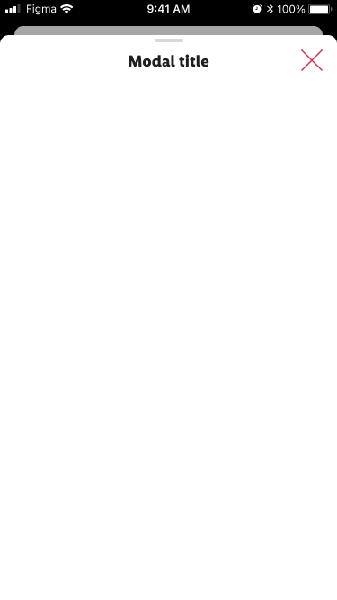 |

### ☾ Dark mode styling for iOS

| Attributes | Modal bottom sheet | Full screen modal |
|---|---|---|
| corner-radius: 10px  text-color: greyscale/dark-mode/general/high-contrast   grabber-color: greyscale/dark-mode/general/low-contrast   icon-color: greyscale/dark-mode/general/high-contrast    background-color: greyscale/dark-mode/background/Android/16dp   shadow: Android-dark-mode/16dp | 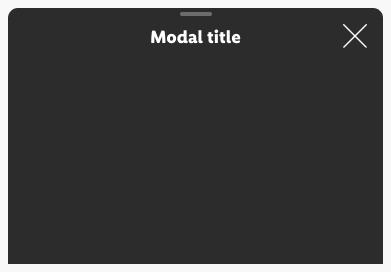 | 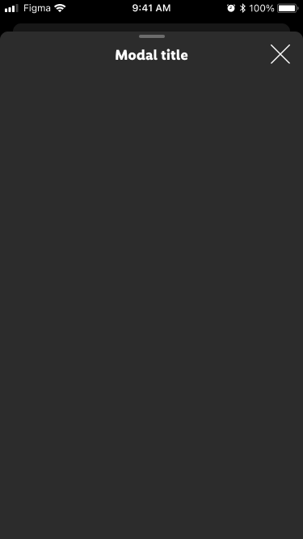 |

---

## Spacing & measurements

### Android specs

| Type | Attributes | Preview
|---|---|---|
| horizontal  | margins: 16px   grabber-width: 24px | 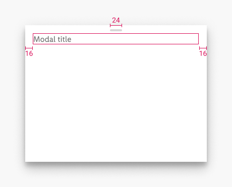 |
| vertical  | margin-top (title): 16px   grabber-padding: 8px | 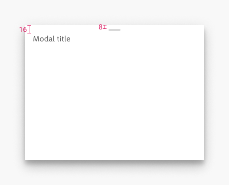 |

### iOS specs

| Type | Attributes | Preview
|---|---|---|
| horizontal  | margin (icon): 16px   margin (title): 56px   distance (title-icon): 16px | 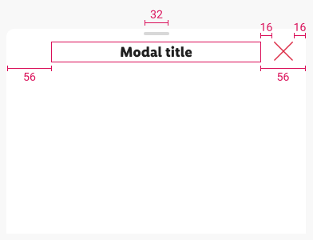 |
| vertical  | top-margin (title): 16px   distance (title-grabber): 8px   top-margin (icon): 16px | 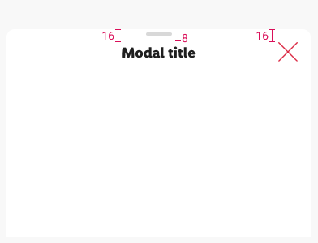 |
| icon size | 24X24px| 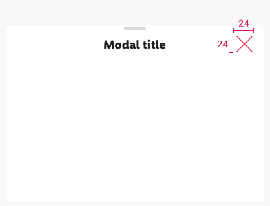 |

---

## What can be modified?

- Change the background color.
- Use left and right text buttons if needed (iOS).
- Override the text and icons.
- Hide icons if not needed (iOS).
- Hide grabber if not needed.
- Adjust the width.
