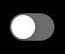
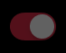
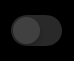

<AlertWarning alertHeadline="Not modifiable"> 
It is mandatory to maintain the appearance and behavior of these components.
</AlertWarning>

# Switch

A switch is a component which is used to toggle the state of a single item between on or off. 

We use native Android and iOS switch components in combination with PARKSIDE brand colors.

---

## Recommendations

- Use switches inside list components only.
- Don't place any labels to describe the state of the switch – it is either on or off.

## Android switch

### ☀ Light mode styling for Android

| States | Attributes |  Preview |
|---|---|---|
|off|knob-color: basic/white   background-color: greyscale/light-mode/general/low-contrast ||
|on|knob-color: brand-primary/base   background-color: brand-primary/light||
|on-disabled|opacity: 38%  knob-color: brand-primary/base   background-color: brand-primary/light||
|off-disabled|opacity: 38%  knob-color: basic/white   background-color: greyscale/light-mode/general/low-contrast ||

### ☾ Dark mode styling for Android

| States | Attributes |  Preview |
|---|---|---|
|off|knob-color: greyscale/dark-mode/general/medium-contrast   background-color: greyscale/dark-mode/general/low-contrast ||
|on|knob-color: brand-primary/base   background-color: brand-primary/light ||
| on-disabled | opacity: 38% knob-color: brand-primary/base   background-color: brand-primary/light ||
|off-disabled |opacity: 38% knob-color: greyscale/dark-mode/general/medium-contrast  background-color: greyscale/dark-mode/general/low-contrast ||

## iOS switch

### ☀ Light mode styling for iOS

| States | Attributes |  Preview |
|---|---|---|
|off|knob-color: basic/white   background-color: greyscale/light-mode/general/extra-low-contrast||
|on|knob-color: basic/white   background-color: brand-primary/base ||
|on-disabled|opacity: 38% knob-color: basic/white   background-color: brand-primary/base ||
|off-disabled|opacity: 38% knob-color: basic/white   background-color: greyscale/light-mode/general/extra-low-contrast||

### ☾ Dark mode styling for iOS

| States | Attributes |  Preview |
|---|---|---|
|off|knob-color: basic/white   background-color: greyscale/dark-mode/general/low-contrast ||
|on|knob-color: basic/white   background-color: brand-primary/base ||
|on-disabled |opacity: 38% knob-color: basic/white   background-color: brand-primary/base ||
|off-disabled|opacity: 38% knob-color: basic/white   background-color: greyscale/dark-mode/general/low-contrast||

---
