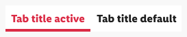
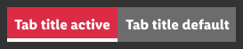
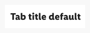
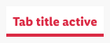
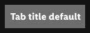
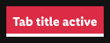
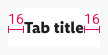
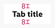
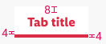

<AlertInfo alertHeadline="Modifiable">
Please ensure to comply with the corporate identity. A detailed list about [what can be modified?](#what-can-be-modified) is defined.
</AlertInfo>

# Tab

Tabs organize the content across different screen areas.

---

## Recommendations

- Only one tab page can be active, the other tab is default.
- Only the content of the activated tab is visible to the user.
- Use the tab to organize different content areas.

---

## Overall styling

- The text-style is [basic bold](../../../../App/Fundamental/General/Typography/Typography.md#basic-bold).
- The line-height is **default**.
- The indicator has a **thickness of 4px**.

 ☀ Light mode | ☾ Dark mode
---------|----------
  | 

---

## Elements

### ☀ Light mode styling

| Types | Attributes | Preview |
|---|---|---|
| default | text-color: greyscale/light-mode/general/high-contrast background-color: greyscale/light-mode/background/light-1 |  |
| active | text-color: brand-primary-base background-color: greyscale/light-mode/background/-light-1 indicator: brand-primary-base |  |

### ☾ Dark mode styling

| Types | Attributes | Preview |
|---|---|---|
| default | text-color: greyscale/dark-mode/general/high-contrast background-color: greyscale/dark-mode/general/low contrast|  |
| active | text-color: greyscale/dark-mode/general/high-contrast background-color: brand-primary-base indicator: greyscale/dark-mode/general/high-contrast |  |

---

## Spacing & measurements

| Types | Attributes | Preview |
|---|---|---|
| horizontal spacing | The tab component can be variable in width but the text is always centered and has a minimum spacing of 16px. |  |
| vertical spacing default | padding-top: 8px padding-bottom: 8px |   |
| vertical spacing active |padding-top: 8px padding-bottom: 4px indicator: 4px||

---

## What can be modified?

- Override the text.
- Adjust the width of single symbols according to the width of the device.
