<AlertInfo alertHeadline="Modifiable">
Please ensure to comply with the corporate identity. A detailed list about [what can be modified?](#what-can-be-modified) is defined.
</AlertInfo>

# Top bar

Both Android and iOS top bars contain content and show actions to the user regarding the current screen. They contain titles, navigation, possible user actions and offer possibilities for branding.

---

## Principles

- They always appear at the top of each screen and can in some cases disappear upon scrolling.
- They act as a guide for the user by helping with navigation inside the app.
- They always have a consistent position which increases familiarity – the user always knows where to find them.

---

## Anatomy

### Android

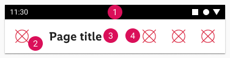

1. Status bar

2. Left icon

3. Title

4. Space for icons

### iOS

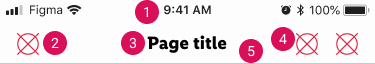

1. Status bar

2. Left icon

3. Title

4. Space for icons or a text button.

5. Divider (hairline)

---

## Overall styling

### Android

- The title uses the text-style [large bold](../../General/Typography/Typography.md#large-bold).
- The line-height is **120%**.
- The icon con size is **24x24px**.
- Title text has always **one line**.
- Elevation shadow is always **1dp**.

### iOS

- The title uses the text-style [basic bold](../../General/Typography/Typography.md#basic-bold).
- The line-height is **default**.
- The icon con size is **24x24px**.
- Divider at the bottom has **0.5px** width.
- Title text has always **one line**.

---

## Variants

- Android and iOS top bars are available in standard and extended sizes and support both light and dark mode.

### Android variants

| Size | Mode | Attributes | Preview |
|---|---|---|---|
| standard | ☀ | background-color: greyscale/light-mode/background/light-1    text-color: greyscale/light-mode/general/high-contrast   icon-color: brand-primary-base | 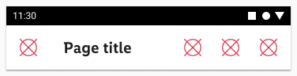
| standard | ☾ | background-color: greyscale/dark-mode/background/Android/1dp    text-color: greyscale/dark-mode/general/high-contrast   icon-color: greyscale/dark-mode/general/high-contrast | 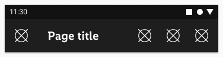
| extended | ☀ | background-color: greyscale/light-mode/background/light-1    text-color: greyscale/light-mode/general/high-contrast   icon-color: brand-primary-base | 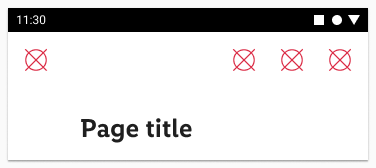 |
| extended | ☾ | background-color: greyscale/dark-mode/background/Android/1dp    text-color: greyscale/dark-mode/general/high-contrast   icon-color: greyscale/dark-mode/general/high-contrast  | 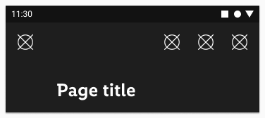

### iOS variants

| Size | Mode | Attributes | Preview |
|---|---|---|---|
| standard | ☀ | background: iOS-material/light-mode/thick    text-color: greyscale/light-mode/general/high-contrast   icon-color: brand-primary-base divider: greyscale/light-mode/general/low-contrast | 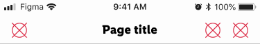
| standard | ☾ | background: iOS-material/dark-mode/thick    text-color: greyscale/dark-mode/general/high-contrast   icon-color: greyscale/dark-mode/general/high-contrast divider: greyscale/dark-mode/general/low-contrast | 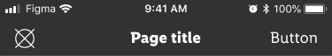
| extended | ☀ | background: iOS-material/light-mode/thick    text-color: greyscale/light-mode/general/high-contrast   icon-color: brand-primary-base divider: greyscale/light-mode/general/low-contrast | 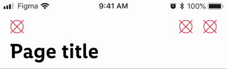
| extended | ☾ | background: iOS-material/dark-mode/thick    text-color: greyscale/dark-mode/general/high-contrast   icon-color: greyscale/dark-mode/general/high-contrast divider: greyscale/dark-mode/general/low-contrast  | 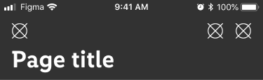

---

## Spacing & measurements

### Android spacing

| Type | Size | Preview |
|---|---|---|
| horizontal spacing | standard | 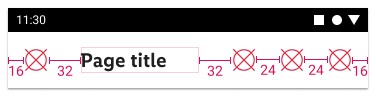 |
| vertical spacing | standard | 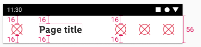 |
| horizontal spacing | extended | 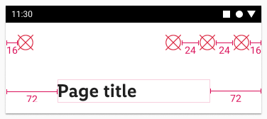 |
| vertical spacing | extended | 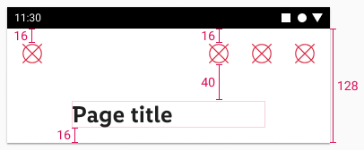 |

### iOS spacing

| Type | Size | Preview |
|---|---|---|
| horizontal spacing | standard | 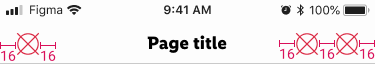 |
| vertical spacing | standard | 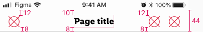 |
| horizontal spacing | extended | 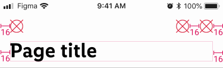 |
| vertical spacing | extended | 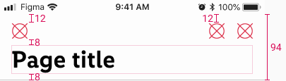 |

---

## What can be modified?

- Override the text and icons.
- Remove icons if not needed.
- Adjust the width.

## Our workflow in Figma

- Use the option in layers panel to unhide/hide the layers for buttons (iOS only) and icons according to your needs.
