<AlertWarning alertHeadline="Not modifiable">
It is mandatory to maintain the appearance and behavior of these components.
</AlertWarning>

# Colors

Colors help to emphasize and highlight brand's appearance.

---

## Color concept

- Our color concept is a result of our accessibility problems.
- In developing this concept, we focused on **simplicity**, **clarity**, **adaptation** and **portability to the frontend**.

### Color scale

- The scale has a total of **6 levels**.
- It’s principally based on a **base** color as a reference.
- The basic color becomes either lighter (light, lighter, lightest) or darker (dark, darker).

---

## Brand colors

- The Parkside brand colors communicate the personality of the brand.

### Brand-primary (Parkside red)

- It seems interactive.
- The base color is used for icons & links, to symbolize activeness, to show possible selection or highlight or different conditions.

| Name | Values | Concept | Color |
|---|---|---|---|
| base | HEX: #DB2B45 RGB: 219 / 43 / 69 | - |  |
| lightest  | HEX: #FDF6F7 RGB: 253 / 246 / 247 | base +96% white |  |
| lighter | HEX: #F9DCE1 RGB: 249 / 220 / 225 | base +84% white | 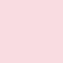 |
| light | HEX: #ED99A6 RGB: 237 / 153 / 166 | base +52% white |  |
| dark | HEX: #B72439 RGB: 183 / 36 / 57 | base +16% black |  |
| darker | HEX: #941D2E RGB: 148 / 29 / 46 | base +32% black |  |

### Blue (Parkside blue)

- Accent color for workshop-performance category of products.

| Name | Values | Concept | Color |
|---|---|---|---|
| base | HEX: #167599 RGB: 22 / 117 / 153 | - |  |
| lightest | HEX: #F5F9FB RGB: 245 / 249 / 251 | base +96% white | 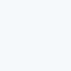 |
| lighter | HEX: #D9E8EE RGB: 217 / 232 / 238 | base +84% white |  |
| light | HEX: #8FBCCE RGB: 143 / 188 / 206 | base +52% white |  |
| dark | HEX: #126280 RGB: 18 / 98 / 128 | base +16% black |  |
| darker | HEX: #0E4F67 RGB: 14 / 79 / 103 | base +32% black |  |

### Green (Parkside green)

- Accent color for garden category of products.

| Name | Values | Concept | Color |
|---|---|---|---|
| base | HEX: #4F8738 RGB: 79 / 135 / 56 | - |  |
| lightest | HEX: #F8FAF7 RGB: 248 / 250 / 247 | base +96% white |  |
| lighter | HEX: #E2EBDF RGB: 226 / 235 / 223 | base +84% white | 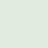 |
| light | HEX: #AAC59F RGB: 170 / 197 / 159 | base +52% white | 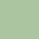 |
| dark | HEX: #42712F RGB: 66 / 113 / 47 | base +16% black |  |
| darker | HEX: #355B25 RGB:53 / 91 / 37 | base +32% black |  |

### Yellow (Parkside yellow)

- Accent color for high pressure category of products.

| Name | Values | Concept | Color |
|---|---|---|---|
| base | HEX: ##FCEA10 RGB: 252 / 234 / 16 | - | 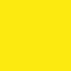 |
| lightest | HEX: #FFFEF5 RGB: 255 / 254 / 245 | base +96% white |  |
| lighter | HEX: #FFFCD9 RGB: 255 / 252 / 217 | base +84% white | 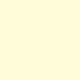 |
| light | HEX: #FEF58C RGB: 254 / 245 / 140 | base +52% white | 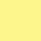 |
| dark | HEX: #D4C50D RGB: 212 / 197 / 13 | base +16% black | 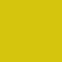 |
| darker | HEX: #AB9F0B RGB: 171 / 159 / 11 | base +32% black | 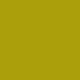 |

### Dark red (Parkside dark red)

- Accent color for workshop-standard category of products.

| Name | Values | Concept | Color |
|---|---|---|---|
| base | HEX: #A51008 RGB: 165 / 16 / 8 | - |  |
| lightest | HEX: #FBF5F5 RGB: 251 / 245 / 245 | base +96% white |  |
| lighter | HEX: #F1D9D7 RGB: 241 / 217 / 215 | base +84% white | 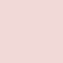 |
| light | HEX: #D48C88 RGB: 212 / 140 / 136 | base +52% white | 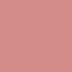 |
| dark | HEX: #8B0D07 RGB: 139 / 13 / 7 | base +16% black |  |
| darker | HEX: #700B05 RGB:112 / 11 / 5 | base +32% black |  |

### Orange

- It stands for danger and shows an error or a malfunction.

| Name | Values | Concept | Color |
|---|---|---|---|
| base | HEX: #EC842C RGB: 236 / 132 / 44 | - |  |
| Lightest | HEX: #FEFAF6 RGB: 254 / 250 / 246 | base +96% white |  |
| lighter | HEX: #FBEBDD RGB: 251 / 235 / 221 | base +84% white |  |
| light | HEX: #F5C49A RGB: 245 / 196 / 154 | base +52% white | 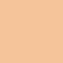 |
| dark | HEX: #C66E24 RGB: 198 / 110 / 36 | base +16% black | 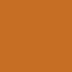 |
| darker | HEX: #A0591D RGB: 160 / 89 / 29 | base +32% black | 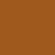 |

### Basic

| Name | Values | Concept | Color |
|---|---|---|---|
| white | HEX: #FFFFFF RGB: 255 / 255 / 255 | - |  |
| black | HEX: #000000 RGB: 0 / 0 / 0 | - |  |

---

## Greyscale

- The greyscale has more gradations and follows a different logic than all the other colors because of Android and iOS dark mode requirements.
- Dark mode background colors for Android and iOS  **should not be mixed**.
- Greyscale general colors are used for text and for states of certain components.

### ☀ Light mode – general greyscale colors

| Name | Values | Color |
|---|---|---|
| high-contrast | HEX: #1F1F1F RGB: 31 / 31 / 31 | 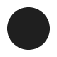 |
| medium-contrast | HEX: #626262 RGB: 98 / 98 / 98 | 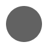 |
| low-contrast | HEX: #979797 RGB: 151 / 151 / 151 | 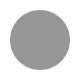 |
| extra-low-contrast | HEX: #D8D8D8 RGB: 216 / 216 / 216 |  |

### ☾ Dark mode – general greyscale colors

| Name | Values | Color |
|---|---|---|
| high-contrast | HEX: #FFFFFF RGB: 255 / 255 / 255 | 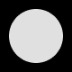 |
| medium-contrast | HEX: #A9A9A9 RGB: 169 / 169 / 169 | 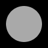 |
| low-contrast | HEX: #6C6C6C RGB: 108 / 108 / 108 | 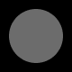 |
| extra-low-contrast | HEX: #2E2E2E RGB: 46 / 46 / 46 | 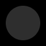 |

### ☀ Light mode – Android and iOS backgrounds

| Name | Values | Color |
|---|---|---|
| light-1 | HEX: #FFFFFF RGB: 255 / 255 / 255 |  |
| light-2 | HEX: #FAFAFA RGB: 250 / 250 / 250 |  |
| light-3 | HEX: #F3F3F3 RGB: 243 / 243 / 243 |  |

### ☾ Dark mode – Android backgrounds (elevations)

| Name | Values | Color |
|---|---|---|
| 00dp | HEX: #121212 RGB: 18 / 18 / 18 | 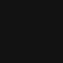 |
| 01dp | HEX: #1E1E1E RGB: 30 / 30 / 30 |  |
| 02dp | HEX: #222222 RGB: 34 / 34 / 34 |  |
| 03dp | HEX: #242424 RGB: 36 / 36 / 36 |  |
| 04dp | HEX: #272727 RGB: 39 / 39 / 39 |  |
| 06dp | HEX: #2C2C2C RGB: 44 / 44 / 44 |  |
| 08dp | HEX: #2E2E2E RGB: 46 / 46 / 46 |  |
| 12dp | HEX: #333333 RGB: 51 / 51 / 51 |  |
| 16dp | HEX: #353535 RGB: 53 / 53 / 53 |  |
| 24dp | HEX: #383838 RGB: 56 / 56 / 56 |  |

### ☾ Dark mode – iOS backgrounds

| Name | Values | Color |
|---|---|---|
| level-1 | HEX: #000000 RGB: 0 / 0 / 0 |  |
| level-2 | HEX: #1C1C1C RGB: 28 / 28 / 28 |  |
| level-3 | HEX: #2C2C2C RGB: 44 / 44 / 44 |  |
| level-4 | HEX: #3A3A3A RGB: 58 / 58 / 58 |  |

---

### Our workflow in Figma

- A color is the smallest ingredient in the library. It is integrated in many other ingredients, doughs and pieces.
- Simply use the color styles provided in PARKSIDE CAKE UI Library.

