<AlertWarning alertHeadline="Not modifiable">
It is mandatory to maintain the appearance and behavior of these components.
</AlertWarning>

# Effects

Shadows show a spatial relationship between different surfaces. They can be used to display interactivity and to highlight and differentiate certain elements from their environment.

Overlays emphasize the contents above it and further hide not relevant information.

---

## Materials

- Materials are used in **iOS system only**.
- Materials are surfaces with opacity and blur effects applied to them.
- They can be used for bottom and top bars, modal screens and alerts.

### ☀ Light mode – iOS thick material

Attributes | Preview
---------|----------
| HEX: #FDFDFD\*  RGBA: 253, 253, 253, 0.92\*  opacity: 92%   background blur: 20  | 

### ☾ Dark mode – iOS thick material

Attributes | Preview
---------|----------
| HEX: #202020\* RGBA: 32, 32, 32, 0.92\*  opacity: 92%   background blur: 20  | 

> *Note: These color values are operating system specific and not part of PARKSIDE brand colors.

## Overlays

- Overlay covers the screen content in the background and highlights the important content above.
- It extends across **the entire viewport**.

Properties | Preview
---------|----------
background-color: basic-black opacity: 56% | 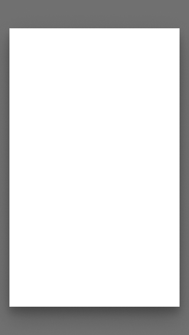

## Shadows

### Android

- We use a default set of shadows from Google's Material design system which are created by a key light and an ambient light.
- There exist 9 shadows for 9 possible elevations and each system mode (dark and light) has its own set of elevation shadows.
- A surface with no elevation (00dp) doesn't have any shadows.
- The color is basic-black and the structure of shadows is based on Android system default shadows.

### ☀ Light mode – Android shadows

01dp | 02dp | 03dp | 04dp | 06dp | 08dp | 12dp | 16dp | 24dp
---------|----------|---------|---------|---------|---------|---------|---------|---------
 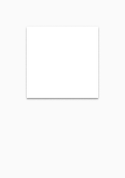 | 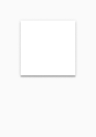 | 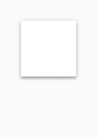 | 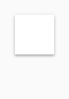 | 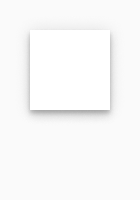 | 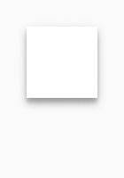 | 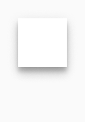 | 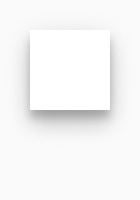 | 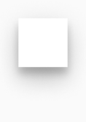

### ☾ Dark mode – Android shadows

01dp | 02dp | 03dp | 04dp | 06dp | 08dp | 12dp | 16dp | 24dp
---------|----------|---------|---------|---------|---------|---------|---------|---------
 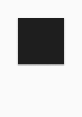 | 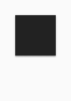 | 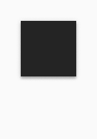 | 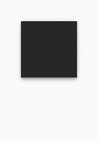 | 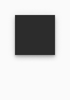 | 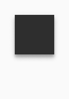 | 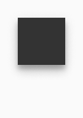 | 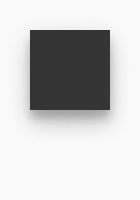 | 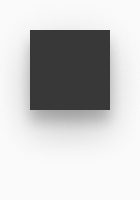

### iOS

- There exists only one default shadow for use in iOS system.

### ☀ Light mode – iOS default shadow

Attributes | Preview
---------|----------
| HEX: #000000  RGBA: 0, 0, 0, 0.8   x: 0   y: 0   opacity: 8%   blur: 16  spread: 8   | 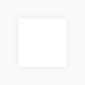

## Spotlight

The product must be shown to it`s best advantage and have a high-quality appearance. A soft glow behind the product image, which acts like a spotlight, highlights the product and enlivens the dark background.

- A spotlight effect is a radial white, soft gradient.
- It is combined with a product shadow.
- The spotlight can be placed only on **dark** backgrounds.

> - Spotlight background shown on the images below is only an example. Other dark backgrounds are also allowed.

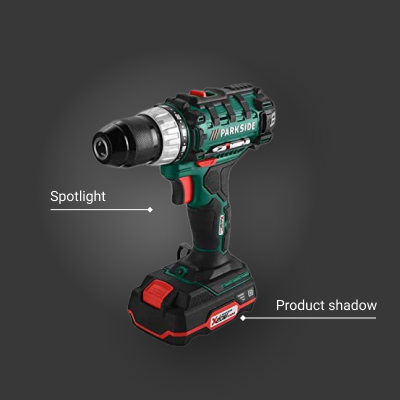

Effect name | Properties | Preview
----------|----------|---------
 Spotlight | color: basic-white  gradient type: radial   opacity-start: 32% opacity-end: 0%  | 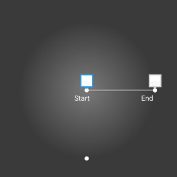
 Product shadow| color: basic-black  type: drop shadow  opacity: 40%   x: 16 y: 16 blur: 56  | 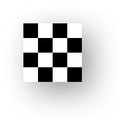

### Spotlight effect setup

- The spotlight effect is placed behind image in a top, left position. The product image with a transparent background will get the product shadow.
- The size of a spotlight square is set to the width of an image multiplied with the factor 1,5.

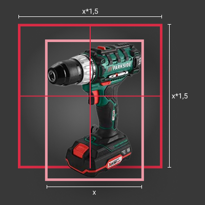
