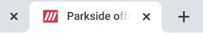

<AlertWarning alertHeadline="Not modifiable">
It is mandatory to maintain the appearance and behavior of these components.
</AlertWarning>

# Favicon

A favicon is a small icon, symbol or logo. 
It mainly appears in a website tab or bookmark. It is an important element as it helps users to recognize a brand faster.

---

## General

- It has to be used as favicon only and can't be integrated into any content.
- All sizes are available in the PARKSIDE Figma assets folder.
- PARKSIDE favicon has been adjusted to ensure optimal appearance in each specific use case, so please use the provided favicons only.
- Level of the visibility of the white outline around the favicon depends on the background color.

| Background | Browser preview |
|---|---|
| dark |  |
| light |  |

---

## Size

- The device resolution depends on the browser and device.
- The favicon is therefore available in different sizes.
- The table below demonstrates the use cases.

| Size | Device or Purpose |
|---|---|
| 16x16 | Browser favicon (SVG, PNG) |
| 32x32 | Taskbar shortcut icon |
| 70x70 | Windows 10 |
| 96x96 | Desktop shortcut icon (and Google TV) |
| 120x120 | iPhone Retina (iOS 7) |
| 128x128 | Chrome Webstore icon |
| 152x152 | iPad Retina (iOS 7) |
| 167x167 | iPad Pro (iOS 8+) |
| 180x180 | iPhone 6 Plus (iOS 8+) |
| 196x196 | Android Chrome icon |
| 228x228 | Opera Coast icon |
| 270x270 | Windows 10 |
| 310x310 | Windows 10 |
| 310x150 | Windows 10 |
