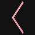
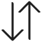
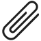
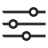
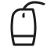
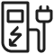
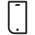
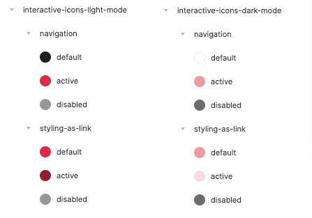
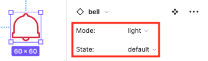

<AlertWarning alertHeadline="Not modifiable">
It is mandatory to maintain the appearance and behavior of these components.
</AlertWarning>

# Icons

Icons are  an essential element of design and are also known as pictograms. They can stand individually, be displayed together, or be part of an element.

They support the understanding of an information or function. Symbols are easier to read than text. They are mainly used to identify a function. It can also be used as an infographic or illustration.

---

## General

- The appearance of the icon depends on the usage or context.
- Icons have an original size of **60x60px**.
- The size has to follow the **rule of 8** (8, 16, 24, 32, …).
- In some cases 8x8px icons can have **suboptimal visibility** because of the thineness of the line, and in such cases please contact [CAKE team](mailto:cake@lidl.com) for discussion about possible solutions.

---

## Usage

- Icons can be used for **status**, as **links**, as **navigation**,  to **support** another element (in alerts, buttons, input-fields, etc.) or as  **illustration**.

---

## Light mode styling

**Styling as navigation**

State | Attributes | Preview
---------|----------|---------
 default | greyscale/light-mode/general/high-contrast | 
 active | brand-primary-base | 
 disabled | greyscale/light-mode/general/low-contrast | 

 **Styling as link**

State | Attributes | Preview
---------|----------|---------
 default | brand-primary-base | 
 active | brand-primary-darker | 
 disabled | greyscale/light-mode/general/low-contrast | 

 **Styling as status**

State | Attributes | Preview
---------|----------|---------
 default | brand-primary-base | 
 active | brand-primary-base | 
 disabled | greyscale/light-mode/general/low-contrast | 

## Dark mode styling

**Styling as navigation**

State | Attributes | Preview
---------|----------|---------
 default | greyscale/dark-mode/general/high-contrast | 
 active | brand-primary-light | 
 disabled | greyscale/dark-mode/general/low-contrast |

 **Styling as link**

State | Attributes | Preview
---------|----------|---------
 default | brand-primary-light  | 
 active | brand-primary-lighter | 
 disabled | greyscale/dark-mode/general/low-contrast | 

 **Styling as status**

State | Attributes | Preview
---------|----------|---------
 default | brand-primary-light | 
 active | brand-primary-light | 
 disabled | greyscale/dark-mode/general/low-contrast | 

---

## Expression

- Icons symbolize a special expression, e.g. message about incorrect input or correct input, legal information, etc.
- Icons that support textual information visually.

| Name | Icon | Purpose |
|---|---|---|
| award |  | quality |
| certificate |  | diploma, license |
| comment |  | speech bubble, text |
| conversation-ballons |  | feedback |
| conversation-ballons-chat |  | chat |
| dice-percentage |  | competition, gambling |
| exclamation-ballon |  | statement, answer |
| exclamation-circle |  | attention |
| exclamation-triangle |  | danger |
| gift-close |  | present |
| gift-open |  | surprise |
| handshake |  | collaboration, cooperation, support |
| hook-circle |  | check, ok, success |
| hook-shield |  | security, shield |
| hook-square |  | checkbox |
| information-circle |  | information |
| lightbulb-off |  | light off, bulb, turned off |
| lightbulb-on |  | idea, light on, bulb, note, tip |
| newspaper |  | news |
| paragraph-circle |  | imprint, legal, disclaimer |
| piggy-bank |  | save money, cash, savings |
| questionmark-ballon |  | question |
| questionmark-circle |  |   |
| stop-sign |  | stop  |
| thumbs-up-ballon |  | feedback, social media |

---

## Interaction

- These icons are used for interactions.
- The user remains in the current position and the icon triggers an action.
- The icon offers the user a function, action or position.

| Name | Icon | Purpose |
|---|---|---|
| 360-degree |  |  |
| arrow-left-circle |  | back |
| arrow-right-circle |  | next |
| arrows-expand |  | enlarge, full screen |
| arrows-vertical |  | sort |
| bars-horizontal |  | menu |
| book-open |  | read, literature |
| bulletlist |  |  |
| calendar-clock |  | appointment, schedule |
| calendar |  | date, appointment |
| camera |  | photo |
| checklist |  |  |
| clip |  | attachment |
| clock |  | time |
| cogwheel |  | settings |
| controls |  | settings, slider |
| crosshair |  | locate |
| download |  | save |
| ellipsis-horizontal |  | more |
| envelope-close |  | address |
| envelope-open |  | newsletter |
| external-link |  | new window, link out, external link  |
| eye-close |  | hide |
| eye-open |  | show |
| file |  | paper |
| fingerprint |  | identity |
| flyer |  | leaflets |
| hand-pointer |  |  |
| hook |  | check, ok |
| house |  | home |
| invoice |  | paper, notes, bill, receipt, document |
| lock-close |  | security, secure |
| lock-open |  | insecure |
| magnifier-plus |  | zoom in |
| magnifier-minus |  | zoom out |
| magnifier |  | zoom |
| map-marker |  | location |
| map |  |  |
| microphone-on |  | voice |
| minus |  | less |
| paper-plane |  | send, submit, post |
| pause-circle |  | pause |
| pencil |  | edit |
| phone-envelope |  | contact |
| phone |  | call |
| placeholder |  |  |
| play-circle |  | play |
| plus |  | more |
| printer |  | print |
| share |  | upload |
| shopping-bag |  |  |
| shopping-cart-1 |  |  |
| shopping-cart-2 |  | express |
| social-share |  |  |
| square |  | grid |
| store |  |  |
| store-magnifier |  | search store |
| sync |  | refresh, rotate |
| trash |  | delete |
| upload |  |  |
| user-eighteen-plus |  | adults only |
| user |  | account, profile |
| volume-up |  |  |

---

## Navigation

- These icons are used for navigation – the user is redirected from the current position.

| Name | Icon | Purpose |
|---|---|---|
| arrow-down |  | down, expand |
| arrow-left |  | left, back |
| arrow-right |  | right, forward |
| arrow-up |  | up, collapse |
| cross |  | close, quit, abort |
| undo |  |  |

---

## Status

- Icons that can change their appearance after an activation of the user (e.g. add to wishlist, like, set reminder).
- **Only these icons** switch from the **regular** outline look to a **solid** look when active.

| Name | Icon | Purpose |
|---|---|---|
| bell-regular |  | alarm, reminder |
| bell-solid |  | alarm, reminder |
| bookmark-regular |  | chapter |
| bookmark-solid |  | chapter |
| heart-regular |  | favorite, watchlist |
| heart-solid |  | favorite, watchlist |
| star-regular |  | favorite |
| star-solid |  | favorite |
| thumbs-up-regular |  | like, feedback |
| thumbs-up-solid |  | like, feedback |
| thumbs-down-regular |  | dislike |
| thumbs-down-solid |  | dislike |

---

## Technology

- Icons that deal with the topic of technology.

| Name | Icon | Purpose |
|---|---|---|
| computer-mouse |  | software |
| display-play |  | video |
| display |  | screen |
| e-charging-station|  | mobility, charging, e-station |
| keyboard|  | hardware, typing|
| power|  | plug, electric |
| smartphone |  | mobile |
| wifi |  |  |

---

## Our workflow in Figma

For your convenience we organized colors for interactive icons around the mode (light and dark), context of use (navigation and link) and states (default, active and disabled). All **status icons** are built as components with variants, which means that upon placing a component the drop-down menus for its mode and state are available in the right panel.

Colors for interactive icons | Status icon variant options |
---------|----------|
  | |
