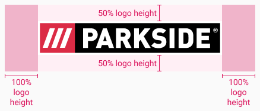

<AlertWarning alertHeadline="Not modifiable">
It is mandatory to maintain the appearance and behavior of these components.
</AlertWarning>

# Logo

The logo gives a visual representation of your company brand.

---

## General

- The PARKSIDE logo has a great recognition value and serves as a foundation for the visual identity of the brand.
- The logo is an unchangeable word and image mark that may only be used in the specified manner.
- Proportions and colors are subject to fixed definitions and must be strictly adhered to.

---

## Logo RGB

- The logo is the most important recognition element of the PARKSIDE brand.
- Logo version without a registered trademark symbol, ®, should be used when logo width is smaller than 300px.
- Level of the visibility of the white outline around the logo depends on the background color.

Width | Preview |
---------|----------|
 299px or less |  |
 300px or more |  |

---

## Protection zone

- In order to guarantee the integrity of the PARKSIDE logo, a protection zone that is free of visual disturbances and distractions is established around it.
- No other graphic or typographic elements should be placed in this protection zone.
- Image elements on the background where the logo is placed should be calm (ideally in one color only) and shouldn't interfere with logo's recognizability.
- The PARKSIDE logo has a protection zone of 100% of its logo height left and right, and top and bottom protection zone with only 50% of logo height.  

