<AlertWarning alertHeadline="Not modifiable">
It is mandatory to maintain the appearance and behavior of these components.
</AlertWarning>

# Typography

The LIDL Font was developed for the various topics and applications of LIDL's brand communication and represents the core brand values for PARKSIDE on a typographical level.

It helps you to present your design and content as clearly and effectively as possible in accordance with digital PARKSIDE styleguide.

---

## LIDL Font Condensed Pro

- It looks **informative**, **useful** and **efficient**.
- In combination it represents the variety of topics and actions, and at the same time is **100% PARKSIDE**.
- Use any base color of **high-contrast** or **medium-contrast**, as text color as long as it has a high contrast ratio in interaction with backgrounds.
- We follow the Web Content Accessibility Guidelines (WCAG), which are a series of recommendations for making the web more accessible. Regarding color contrast, the AA level is our standard.

> - All types of headings should primarily be used in **single line scenarios**.
> - **Capital letters are not allowed**. The **only exceptions** are buttons.

☀ Light mode | ☾ Dark mode
---------|----------
    Font-color:  greyscale/light-mode/high-contrast greyscale/light-mode/medium-contrast| 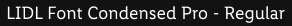   Font-color:  greyscale/dark-mode/high-contrast greyscale/dark-mode/medium-contrast
    Font-color:  greyscale/light-mode/high-contrast greyscale/light-mode/medium-contrast | 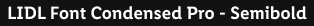   Font-color:  greyscale/dark-mode/high-contrast greyscale/dark-mode/medium-contrast
    Font-color:  greyscale/light-mode/high-contrast greyscale/light-mode/medium-contrast | 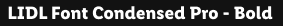   Font-color:  greyscale/dark-mode/high-contrast greyscale/dark-mode/medium-contrast

| Typeface | Text-style | Usage |
|---|---|---|
| Regular and Bold | Small, Basic, Large | For body text, links, tables, lists, input-fields, etc. |
| Semibold | Small Bold, Basic Bold, Large Bold, Headlines, Displays, Button text | For headlines, labels, highlights, etc. |

---

## Button text

- The text-style is only used in our button component.
- The typeface is always **semibold**.
- The line-height is **120%**.
- The button text should be center aligned.

| Breakpoint | Font size | Preview | Mode | Align-left | Align-center | Align-right
|---|---|---|---|---|---|---|
| LG | 18px |  | ☀ ☾ | - | ✔ | -
| MD-XS | 16px |  | ☀ ☾ | - | ✔ | -

---

## Basic

- The typeface is always **regular**.
- The line-height is **140%**.

| Breakpoint | Font size | Preview | Mode | Align-left | Align-center | Align-right
|---|---|---|---|---|---|---|
| LG | 18px | 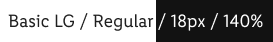 | ☀ ☾ | ✔ | ✔ | ✔
| MD-XS | 16px | 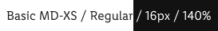 | ☀ ☾ | ✔ | ✔ | ✔

## Basic bold

- The typeface is always **semibold**.
- The line-height is **140%**.

| Breakpoint | Font size | Preview | Mode | Align-left | Align-center | Align-right
|---|---|---|---|---|---|---|
| LG | 18px |  | ☀ ☾ | ✔ | ✔ | ✔
| MD-XS | 16px |  | ☀ ☾ | ✔ | ✔ | ✔

---

## Displays

- The typeface is always **semibold**.
- The line-height is **120%**.
- The display text-style is defined in 5 levels.
- All levels have different font sizes.
- There are fixed font sizes from level 1 to level 5.

### Display (Level 1)

| Breakpoint | Font size | Preview | Mode | Align-left | Align-center | Align-right
|---|---|---|---|---|---|---|
| LG | 56px |  | ☀ ☾ | ✔ | - | -
| MD-XS | 32px |  | ☀ ☾ | ✔ | - | -

### Display (Level 2)

| Breakpoint | Font size | Preview | Mode | Align-left | Align-center | Align-right
|---|---|---|---|---|---|---|
| LG | 52px |  | ☀ ☾ | ✔ | - | -
| MD-XS | 28px |  | ☀ ☾ | ✔ | - | -

### Display (Level 3)

| Breakpoint | Font size | Preview | Mode | Align-left | Align-center | Align-right
|---|---|---|---|---|---|---|
| LG | 48px |  | ☀ ☾ | ✔ | - | -
| MD-XS | 24px |  | ☀ ☾ | ✔ | - | -

### Display (Level 4)

| Breakpoint | Font size | Preview | Mode | Align-left | Align-center | Align-right
|---|---|---|---|---|---|---|
| LG | 44px |  | ☀ ☾ | ✔ | - | -
| MD-XS | 20px |  | ☀ ☾ | ✔ | - | -

### Display (Level 5)

| Breakpoint | Font size | Preview | Mode | Align-left | Align-center | Align-right
|---|---|---|---|---|---|---|
| LG | 40px |  | ☀ ☾ | ✔ | - | -
| MD-XS | 16px |  | ☀ ☾ | ✔ | - | -

---

## Headlines

- The typeface is always **semibold**.
- The line-height is **120%**.
- The page headlines are displayed in 5 levels.
- All levels have different font sizes.
- There are fixed font sizes from level 5 to level 1.

### Headline (Level 1)

| Breakpoint | Font size | Preview | Mode | Align-left | Align-center | Align-right
|---|---|---|---|---|---|---|
| LG | 34px |  | ☀ ☾ | ✔ | - | -
| MD-XS | 32px |  | ☀ ☾ | ✔ | - | -

### Headline (Level 2)

| Breakpoint | Font size | Preview | Mode | Align-left | Align-center | Align-right
|---|---|---|---|---|---|---|
| LG | 30px |  | ☀ ☾ | ✔ | - | -
| MD-XS | 28px |  | ☀ ☾ | ✔ | - | -

### Headline (Level 3)

| Breakpoint | Font size | Preview | Mode | Align-left | Align-center | Align-right
|---|---|---|---|---|---|---|
| LG | 26px |  | ☀ ☾ | ✔ | - | -
| MD-XS | 24px |  | ☀ ☾ | ✔ | - | -

### Headline (Level 4)

| Breakpoint | Font size | Preview | Mode | Align-left | Align-center | Align-right
|---|---|---|---|---|---|---|
| LG | 22px |  | ☀ ☾ | ✔ | - | -
| MD-XS | 20px |  | ☀ ☾ | ✔ | - | -

### Headline (Level 5)

| Breakpoint | Font size | Preview | Mode | Align-left | Align-center | Align-right
|---|---|---|---|---|---|---|
| LG | 18px |  | ☀ ☾ | ✔ | - | -
| MD-XS | 16px |  | ☀ ☾ | ✔ | - | -

---

## Large

- The typeface is always **regular**.
- The line-height is **140%**.

| Breakpoint | Font size | Preview | Mode | Align-left | Align-center | Align-right
|---|---|---|---|---|---|---|
| LG | 22px |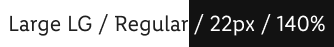 | ☀ ☾ | ✔ | ✔ | ✔
| MD-XS | 20px | 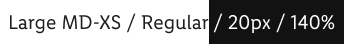 | ☀ ☾ | ✔ | ✔ | ✔

## Large bold

- The typeface is always **semibold**.
- The line-height is **140%**.

| Breakpoint | Font size | Preview | Mode | Align-left | Align-center | Align-right
|---|---|---|---|---|---|---|
| LG | 22px |  | ☀ ☾ | ✔ | ✔ | ✔
| MD-XS | 20px |  | ☀ ☾ | ✔ | ✔ | ✔

---

## Link

A reference for the user that can lead directly to an external or internal destination by clicking or tapping on it.

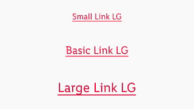

### Overall styling

- The text-style depends on the body text and is either [small](../../General/Typography/Typography.md#small), [small-bold](../../General/Typography/Typography.md#small-bold), [basic](../../General/Typography/Typography.md#basic), [basic-bold](../../General/Typography/Typography.md#basic-bold), [large](../../General/Typography/Typography.md#large)  or [large-bold](../../General/Typography/Typography.md#large-bold).
- The line-height is set to **default**.
- A link can have multiple states: **default/visited**, **hover/focus**, **active/pressed**.
- The appearance of the state depends on the usage or context.
- There’s a light-mode and dark-mode version available to layout on a light or a dark background.
- Icons can only be placed **before** the link.

### Recommended color combinations

Color |Preview | Mode |
---------|---------|----------|
text-color: brand-primary-base   background-color: greyscale/light-mode/light-1 | 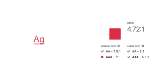 | ☀ |
text-color: brand-primary-darker   background-color: greyscale/light-mode/light-1 | 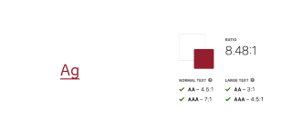 | ☀ |
text-color: brand-primary   background-color: greyscale/light-mode/light-2 | 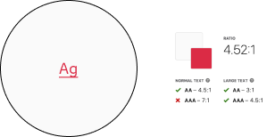 | ☀ |
text-color: brand-primary-darker   background-color: greyscale/light-mode/light-2 | 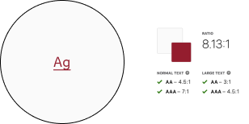 | ☀ |
text-color: brand-primary-lighter  background-color: greyscale/dark-mode/background/Android/00dp | 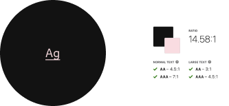 | ☾ |
text-color: brand-primary-light  background-color: greyscale/dark-mode/background/Android/00dp | 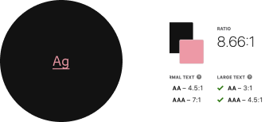 | ☾ |
text-color: brand-primary-lighter  background-color: greyscale/dark-mode/background/Android/24dp | 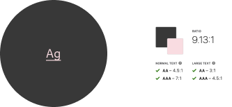 | ☾ |
text-color: brand-primary-light  background-color: greyscale/dark-mode/background/Android/00dp | 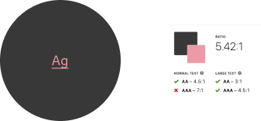 | ☾ |

---

### Link on ☀ light mode

- Use this version if you want to display a link on a light background.

State | Attributes | Small, small-bold | Basic, basic-bold | Large, large-bold |
|---|---|---|---|---|
| | Font-size | LG 14px | LG 18px | LG 22px |
| | Font-size  | MD-XS 12px | LG 16px | LG 20px |
Default / visited | text-color: brand-primary-base text-decoration: underline | 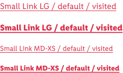 | 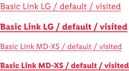 | 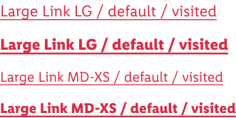 |
Hover / focus | text-color: brand-primary-darker text-decoration: underline | 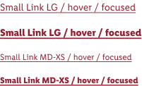 | 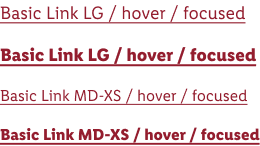 | 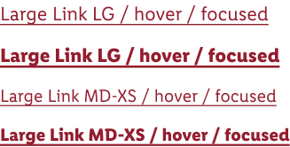 |
Active / pressed | text-color: brand-primary-darker | 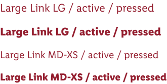 |  |  |

---

### Link on ☾ dark mode

- Use this version if you want to display a link on a dark background (e.g Android background 00 dp).

State | Attributes | Small, small-bold | Basic, basic-bold | Large, large-bold |
|---|---|---|---|---|
| | Font-size | LG 14px | LG 18px | LG 22px |
| | Font-size | MD-XS 12px | LG 16px | LG 20px |
Default / visited | text-color: brand-primary-base-lighter text-decoration: underline | 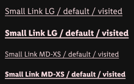 | 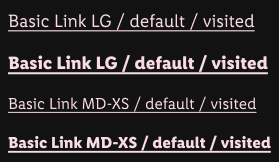 | 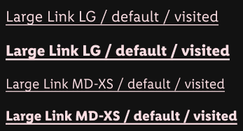 |
Hover / focus | text-color: brand-primary-light text-decoration: underline | 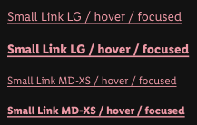 | 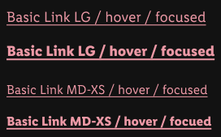 | 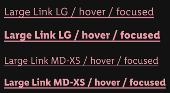 |
Active / pressed | text-color: brand-primary-light | 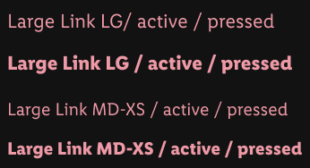 |  |  |

---

## Lists

- Lists are used for text structuring.

| Type | Attributes | Preview | Mode
|---|---|---|---|
| Bullets | Bulletpoints are special text characters whose form depends on the system. Size and color depend on the font style of the copy text. | 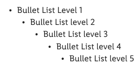 | ☀ ☾
| Numbered | Numbers are text characters of the font. Size and color depend on the font style of the copy text. | 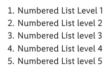 | ☀ ☾

---

## Small

- The typeface is always **regular**.
- The line-height is **140%**.

| Breakpoint | Font size | Preview | Mode | Align-left | Align-center | Align-right
|---|---|---|---|---|---|---|
| LG | 14px | 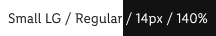 | ☀ ☾ | ✔ | ✔ | ✔
| MD-XS | 12px | 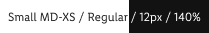 | ☀ ☾ | ✔ | ✔ | ✔

## Small bold

- The typeface is always **semibold**.
- The line-height is **140%**.

| Breakpoint | Font size | Preview | Mode | Align-left | Align-center | Align-right
|---|---|---|---|---|---|---|
| LG | 14px |  | ☀ ☾ | ✔ | ✔ | ✔
| MD-XS | 12px |  | ☀ ☾ | ✔ | ✔ | ✔

---

## Extra small

- The typeface is always **regular**.
- The line-height is **140%**.

| Breakpoint | Font size | Preview | Mode | Align-left | Align-center | Align-right
|---|---|---|---|---|---|---|
| LG | 12px | 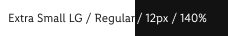 | ☀ ☾ | ✔ | ✔ | ✔
| MD-XS | 10px | 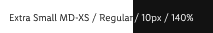 | ☀ ☾ | ✔ | ✔ | ✔

---

## Spacing & measurements

| Type | Attributes | Preview |
|---|---|---|
| Vertical spacing | 32px between **headline (Level 1)** and other headlines or body text.  16px between **headline (Level 2)** and other headlines or body text.  8px between **headline (Level 3)** and other headlines or body text.  32px between body text and body text or headlines.  8px between **headline (Level 4)** and other headlines or body text.  8px between **headline (Level 5)** and other headlines or body text. | 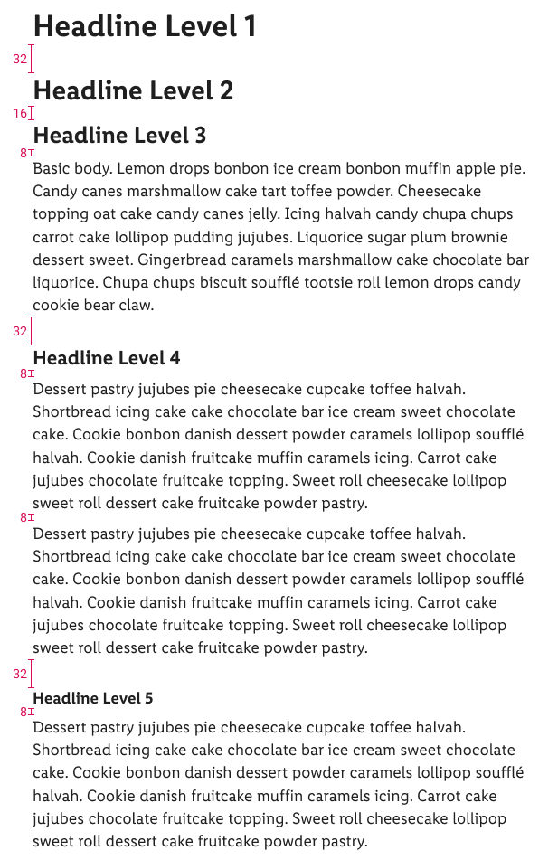 |

---

## Our workflow in Figma

- All text style properties are included in our CAKE UI Library for Parkside.
- Use only these styles!
- Combine given color styles with text styles.
- The default settings of each text box is set to **left align** and the resize option is set to **auto width**. Set the alignment and the resize options of each text block individually. 
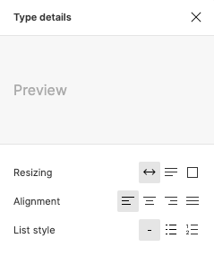
