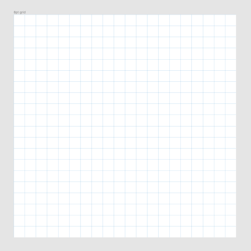
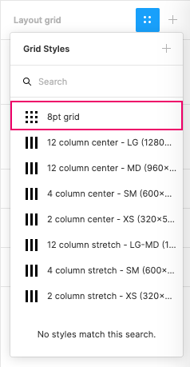

<AlertWarning alertHeadline="Not modifiable">
It is mandatory to maintain the appearance and behavior of these components.
</AlertWarning>

# 8-pt grid

Use increments of 8 to size and space out the elements on a page. This means that any defined height or width, margin or padding will be an increment of 8. Most popular screen sizes are divisible by 8 on at least one axis - usually both.

Description | Preview |
---------|----------|
 The grid can be set on any frame. |  |
It is predefined on the grid styles. |  |

---

## Why 8pts?

- The variety of screen sizes and pixel densities has continued to increase making the work of icon and image generation more complicated for designers.
- The usage of an even number like 8 to size and space elements makes scaling for a wide variety of devices easy and consistent.
- Devices that have a 1.5x resolution will have a hard time cleanly rendering an odd number.
- Scaling 5px by 1.5x will result in a half pixel offset.
- It fits the frontend values of rem (16px).

All our layout resolutions fulfill this requirement:

| LG | MD | SM | XS |
|---|---|---|---|
| `1280x1024px` | `960x600px` | `600x960px` | `320x568px` |

---

## What is the value?

| Designer | Team | User |
|---|---|---|
| Efficiency, less decisions to make while maintaining a quality rhythm between your elements.| A perfect system of communication between designers and developers. A developer can easily identify an 8pt increment instead of having to measure each time. | Consistent aesthetic to the brand they trust. No blurry half-pixel offsets on their preferred device. |
