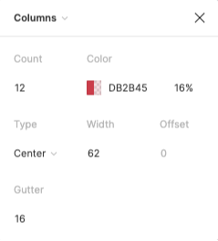
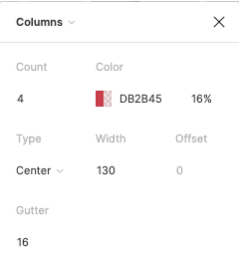
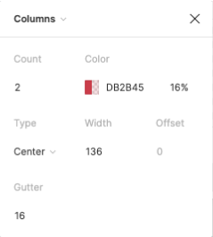
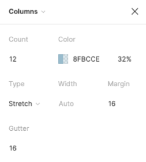
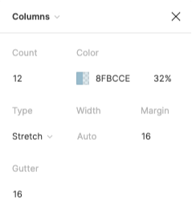
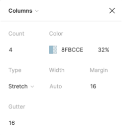
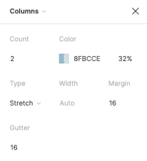

<AlertWarning alertHeadline="Not modifiable">
It is mandatory to maintain the appearance and behavior of these components.
</AlertWarning>

# Layout grid system

A layout grid system can be used to align and size objects within a given frame. It provides visual structure and align objects. Layout grids establish consistency across multiple platforms.

---

## Usage

- Basic rules that help you set up your frames in Figma.
- The responsive behavior of our grid has four breakpoints.
- The amount, width and spacing of the columns change with each breakpoint.
- We do have three layout grid properties available.
  - 8pt grid
  - Column grid center
  - Column grid stretch

---

|  1. Columns | 2. Gutters | 3. Margins |
|---|---|---|
| Content is placed in the areas of the screen that contain columns.  The number of displayed columns is determined by the breakpoint that is chosen. | Gutters are the spaces between columns.  They help separate content. | Margins are the space between content and the left and right edges of the screen. |

---

Layout grid style | Property | Preview
---------|----------|---------
| 8pt grid | **Grid**   Size: 8pt   Color: Werkstatt-brand-primary-blue   Opacity: 32% | 
| Column center | **Column**   Column: Enter X count  Color: Werkstatt-brand-primary-red   Type: center   Opacity: 16%   Gutter: Enter X gutter | 
| Column stretch | **Column**   Column: Enter X count  Color: Werkstatt-brand-primary-blue   Type: center   Opacity: 16%   Gutter: Enter X gutter | 
| Combined on frames | Apply a layout grid to any frame or component. There is a color separation on the column style to differentiate between the column properties.| 

---

## Layout grid properties in Figma

| Type | LG | MD | SM  | XS |
|---|---|---|---|---|
| Frame | Desktop HD | Nexus 7 (landscape) | Nexus 7 (portrait) | iPhone SE |
| Viewport | 1280px - 1440px| 960px | 600px | 320px |
| Columns | 12 columns | 12 columns | 4 columns | 2 columns |
| Width for type center | 91 | 64 | 134 | 144 |
| Gutters | 16px | 16px | 16px | 16px |
| Layout settings type **center** |  |  |  |  |
| Margin for type stretch | 8px / 8px | 8px / 8px | 8px / 8px | 8px / 8px |
| Layout settings type **stretch** |  |  |  |  |