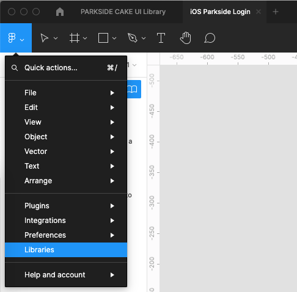
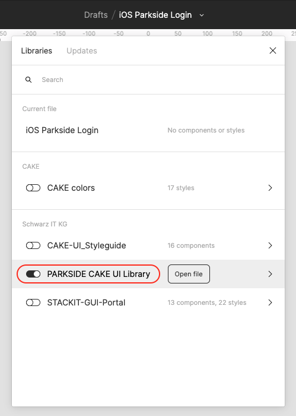

# Setup

PARKSIDE CAKE UI Library is both a rudimentary (colors, typography, icons...) and a component library. In order for you to be able to use it in your own Figma design file, it has to be enabled for that design file first.

---

| Steps | Description | Preview |
|---|---|---|
| 1 | Open the top left Figma menu inside of your design file and choose "Libraries".  |  |
| 2 | Enable the PARKSIDE CAKE UI Library from the list by turning on the switch. | |
